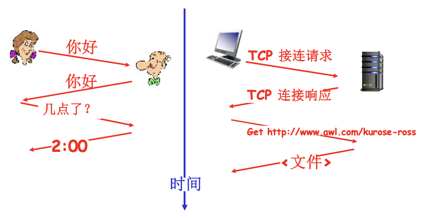

# 📘 1.2 网络边缘 (Network Edge)

> 来源说明：计算机网络（自顶向下方法）第1章 | 本节涵盖：端系统、客户/服务器模式、P2P模式、TCP/UDP服务

---

## 🧠 核心概念总览（严格按原文顺序）

- [*知识点1: 网络边缘概述*](#id1)
- [*知识点2: 端系统(主机)*](#id2)
- [*知识点3: 客户/服务器模式*](#id3)
- [*知识点4: P2P对等模式*](#id4)
- [*知识点5: 面向连接服务——TCP*](#id5)
- [*知识点6: 无连接服务——UDP*](#id6)
- [*知识点7: TCP与UDP的应用场景*](#id7)

---

## ✅ 知识点1: 网络边缘概述

**理论**

- **网络边缘(Network Edge)** 包含：
  - **端系统(End systems)** / **主机(Hosts)**
  - 位于"网络的边缘"

- **目标**
  - 在端系统之间传输数据

🔄 **知识关联**：网络边缘是用户直接接触的部分，与"网络核心"（路由器网状网络）相对。

---

## ✅ 知识点2: 端系统(主机)

**理论**

- **端系统(End Systems)** / **主机(Hosts)**：
  - 运行应用程序
  - 如 **Web**、**email**
  - 位于"网络的边缘"

---

## ✅ 知识点3: 客户/服务器模式

**理论**

- **客户/服务器模式(Client/Server paradigm)**
  - **客户端(Client)**：向服务器请求服务
    - 如 **Web浏览器(Web browser)**、接收邮件客户端
  - **服务器(Server)**：提供服务
    - 始终在线等待客户端请求

💡 **理解技巧**：像餐厅服务，顾客（客户端）点餐，厨房（服务器）提供食物。

---

## ✅ 知识点4: P2P对等模式

**理论**

- **对等模式(Peer-to-Peer, P2P)**
  - 很少（甚至没有）专门的服务器
  - **每个节点既是客户端也是服务器**
  - 示例：**Gnutella**、**KaZaA**、**Emule**

💡 **理解技巧**：像文件共享，你下载文件的同时也在上传给别人，既是"顾客"也是"服务员"。

⚠️ **注意**：P2P模式不需要专用服务器，系统更具弹性但也更难管理。

---

## ✅ 知识点5: 面向连接服务——TCP

**理论**

**目标**：在端系统之间传输数据

### TCP服务 [RFC 793]

**TCP(Transmission Control Protocol，传输控制协议)** 提供以下特性：

| 特性 | 说明 |
|------|------|
| **可靠地、按顺序地传送数据** | 数据不会丢失，按发送顺序到达 |
| **握手(Handshake)** | 数据传输前建立连接 |
| **确认和重传(Acknowledgment & Retransmission)** | 接收方确认收到，丢失则重传 |
| **流量控制(Flow Control)** | 发送方不会淹没接收方 |
| **拥塞控制(Congestion Control)** | 网络拥塞时降低发送速率 |

### TCP握手类比
像人类协议中的"你好、你好"，通信前先打招呼确认双方准备好。

### TCP连接建立过程

⚠️ **警告注意**：TCP是**面向连接的(Connection-oriented)**，传输前必须先建立连接！

📋 **术语提醒**：
- **RFC 793**：TCP协议的官方规范文档
- **SYN(Synchronize)**：同步序列编号
- **ACK(Acknowledgment)**：确认字符

---

## ✅ 知识点6: 无连接服务——UDP

**理论**

**目标**：在端系统之间传输数据

### UDP服务 [RFC 768]

**UDP(User Datagram Protocol，用户数据报协议)** 特点：

| 特性 | 说明 |
|------|------|
| **无连接(Connectionless)** | 不需要建立连接，直接发送 |
| **不可靠数据传输(Unreliable data transfer)** | 不保证送达，可能丢失 |
| **无流量控制(No flow control)** | 发送方可以任意速率发送 |
| **无拥塞控制(No congestion control)** | 网络拥塞时不会减速 |

💡 **理解技巧**：UDP像寄明信片，不需要对方签收，快速但不可靠。

⚠️ **注意**：UDP适合对实时性要求高、能容忍少量丢包的应用。

📋 **术语提醒**：
- **RFC 768**：UDP协议的官方规范文档
- **数据报(Datagram)**：UDP的传输单元

---

## ✅ 知识点7: TCP与UDP的应用场景

**理论**

### 使用TCP的应用

| 应用 | 协议 | 说明 |
|------|------|------|
| **HTTP** | Web浏览 | 需要可靠传输 |
| **FTP** | 文件传送 | 文件不能丢包 |
| **Telnet** | 远程登录 | 需要可靠交互 |
| **SMTP** | 电子邮件 | 邮件必须完整送达 |

### 使用UDP的应用

| 应用 | 场景 | 说明 |
|------|------|------|
| **流媒体(Streaming media)** | 视频直播 | 实时性更重要 |
| **远程会议(Remote conference)** | 视频会议 | 偶尔丢帧可接受 |
| **DNS** | 域名解析 | 快速查询 |
| **Internet电话** | VoIP通话 | 实时通话优先 |

### TCP vs UDP 对比表

| 对比项 | TCP | UDP |
|--------|-----|-----|
| 连接方式 | 面向连接 | 无连接 |
| 可靠性 | **可靠** | **不可靠** |
| 顺序保证 | 有序 | 无序 |
| 流量控制 | 有 | 无 |
| 拥塞控制 | 有 | 无 |
| 速度 | 较慢（开销大） | **快**（开销小） |
| 适用场景 | 文件、网页、邮件 | 视频、语音、游戏 |

⚠️ **关键区别**：
- TCP像**快递**：保证送达，有签收，慢但可靠
- UDP像**普通信**：不保证送达，快但可能丢失

---

## 🔑 核心要点总结

1. **网络边缘组成**：端系统（主机）+ 应用程序

2. **两种通信模式**：
   - 客户/服务器：客户端请求，服务器响应
   - P2P：每个节点既是客户端也是服务器

3. **两种传输层服务**：
   - **TCP**：面向连接、可靠、有流量/拥塞控制
   - **UDP**：无连接、不可靠、无流量/拥塞控制

4. **选择原则**：
   - 需要可靠性 → 选TCP
   - 需要实时性 → 选UDP

---

## 📌 考试速记版

### 关键术语对照
| 中文 | 英文 | 含义 |
|------|------|------|
| 网络边缘 | Network Edge | 端系统和应用所在位置 |
| 端系统 | End System | 网络边缘的主机 |
| 客户/服务器 | Client/Server | 请求-响应模式 |
| P2P | Peer-to-Peer | 对等模式 |
| TCP | Transmission Control Protocol | 传输控制协议 |
| UDP | User Datagram Protocol | 用户数据报协议 |
| 握手 | Handshake | 建立连接的过程 |
| 流量控制 | Flow Control | 防止发送方淹没接收方 |
| 拥塞控制 | Congestion Control | 防止网络过载 |

### 易混淆概念
- **客户/服务器 vs P2P**：前者有明确分工，后者节点角色对等
- **TCP vs UDP**：前者可靠但慢，后者快但不可靠

### 协议选择口诀
> "文件网页用TCP，视频语音用UDP；
> 可靠性选TCP，实时性选UDP。"

**记忆口诀**：
> "TCP三控制：流量、拥塞、重传；
> UDP三没有：连接、可靠、控制。"
