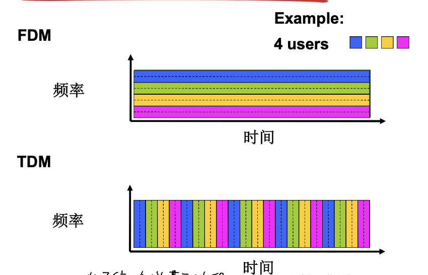

# 📘 1.3 网络核心 (Network Core)

> 来源说明：计算机网络-郑老师-第1章 1.3节 | 本节涵盖：网络核心的两种交换方式（电路交换与分组交换）、多路复用技术、数据报与虚电路网络

---

## 🧠 核心概念总览（严格按原文顺序）

* [*知识点1: 网络核心的定义与基本问题*](#id1)
* [*知识点2: 电路交换（Circuit Switching）的基本原理*](#id2)
* [*知识点3: 电路交换的多路复用技术（FDM、TDM、WDM）*](#id3)
* [*知识点4: 电路交换计算示例*](#id4)
* [*知识点5: 电路交换不适合计算机通信的原因*](#id5)
* [*知识点6: 分组交换（Packet Switching）的基本原理*](#id6)
* [*知识点7: 分组交换的存储-转发机制*](#id7)
* [*知识点8: 排队延迟和分组丢失*](#id8)
* [*知识点9: 网络核心的关键功能（转发与路由）*](#id9)
* [*知识点10: 分组交换的统计多路复用*](#id10)
* [*知识点11: 分组交换 vs 电路交换的对比*](#id11)
* [*知识点12: 分组交换网络的两种类型*](#id12)
* [*知识点13: 数据报（Datagram）网络的工作原理*](#id13)
* [*知识点14: 虚电路（Virtual Circuit）网络的工作原理*](#id14)
* [*知识点15: 网络分类总结*](#id15)

---

<a id="id1"></a>
## ✅ 知识点1: 网络核心的定义与基本问题

**理论**
* **网络核心（Network Core）的定义**：网络核心是由**路由器的网状网络**组成的，核心功能是**交换信息**，依靠**信令系统**维护线路映射
* **网络边缘（Network Edge）与网络核心（Network Core）的关系**：网络边缘包括主机和应用程序，网络核心是互连的路由器
* **基本问题**：数据怎样通过网络进行传输？
  * **电路交换（Circuit Switching）**：为每个呼叫预留一条专有电路，如电话网
  * **分组交换（Packet Switching）**：将要传送的数据分成一个个单位（分组），将分组从一个路由器传到相邻路由器（hop），一段段最终从源端传到目标端，每段采用链路的**最大传输能力（带宽）**

**注意点**
* 📋 **术语提醒**：
  * 跳（Hop）：分组从一个路由器传到相邻路由器的一次传输
* 💡 **理解技巧**：网络核心就像快递转运中心，分组就像包裹，一跳就像从一个转运中心到下一个转运中心

---

<a id="id2"></a>
## ✅ 知识点2: 电路交换（Circuit Switching）的基本原理

**理论**
* **电路交换的核心思想**：端到端的资源被分配给从源端到目标端的**呼叫**
* **资源分配示例**：如果每段链路有4条线路，某呼叫可以采用上面链路的第2个线路，右边链路的第1个线路（piece）
* **电路交换的关键特性**：
  * **独享资源，不共享（No Sharing）**：每个呼叫一旦建立起来就能够保证性能
  * **资源可能浪费**：如果呼叫没有数据发送，被分配的资源就会被浪费
  * **需要建立呼叫连接**：通常被传统电话网络采用
  * **为呼叫预留端-端资源**：包括链路带宽、交换能力
  * **专用资源**：不共享
  * **保证性能**

**注意点**
* ⚠️ **警告注意**：电路交换的"保证性能"是以资源独占为代价的，没有数据传输时资源闲置
* 📋 **术语提醒**：呼叫（Call）在电路交换中指一次端到端的通信会话

---

<a id="id3"></a>
## ✅ 知识点3: 电路交换的多路复用技术（FDM、TDM、WDM）

**理论**
* **多路复用的目的**：网络资源（如带宽）被分成片，为呼叫分配片，如果某个呼叫没有数据，则其资源片处于空闲状态（不共享）
* **三种多路复用技术**：

| 技术 | 英文全称 | 缩写 | 原理 |
|------|----------|------|------|
| 频分多路复用 | Frequency-Division Multiplexing | FDM | 将带宽按频率划分成多个信道 |
| 时分多路复用 | Time-Division Multiplexing | TDM | 将时间划分成时隙，每个呼叫占用固定时隙 |
| 波分多路复用 | Wave-Division Multiplexing | WDM | 光通信中，将光信号分成若干波段 |

* **FDM与TDM图示示意**：


**注意点**
* 📋 **术语提醒**：还有**码分多路复用（CDM, Code-Division Multiplexing）**
* 💡 **理解技巧**：FDM就像不同电台在不同频率广播，TDM就像轮流使用话筒发言

---

<a id="id4"></a>
## ✅ 知识点4: 电路交换计算示例

**理论**
* **问题描述**：在一个电路交换网络上，从主机A到主机B发送一个640,000比特的文件需要多长时间？
  * 所有的链路速率为1.536 Mbps
  * 每条链路使用时隙数为24的TDM
  * 建立端-端的电路需500 ms
* **计算过程**：
  * 每条链路的速率（一个时间片/时隙）：1.536 Mbps ÷ 24 = **64 kbps**
  * 传输时间：640 kb ÷ 64 kbps = **10秒**
  * 建立链路时间：**500 ms**
  * **共用时间 = 传输时间 + 建立链路时间 = 10s + 0.5s = 10.5秒**

**注意点**
* ⚠️ **关键细节**：计算时要考虑时隙数，实际可用带宽是总带宽除以时隙数
* 🔄 **知识关联**：实际共用时间对于接收方还要考虑电磁信号从传输方穿过空间到达的时间代价（传播延迟），之后细讲

---

<a id="id5"></a>
## ✅ 知识点5: 电路交换不适合计算机通信的原因

**理论**
* **原因一：连接建立时间长**
* **原因二：计算机之间的通信有突发性**：如果使用线路交换，则浪费的片较多
  * 即使这个呼叫没有数据传递，其所占据的片也不能够被别的呼叫使用
* **原因三：可靠性不高**：维护线路的映射量大，出问题的话灾区大

**注意点**
* 💡 **理解技巧**：计算机通信特点是"突发式"——短时间内大量数据传输，然后长时间空闲，这与电话持续通话的模式不同
* 🔄 **知识关联**：这也是分组交换被发明出来的原因——为了适应计算机通信的突发性

---

<a id="id6"></a>
## ✅ 知识点6: 分组交换（Packet Switching）的基本原理

**理论**
* **核心思想**：以**分组（Packet）**为单位进行**存储-转发（Store-and-Forward）**
* **资源共享方式**：
  * 网络带宽资源不再分为一个个片，传输时使用**全部带宽**
  * **资源共享，按需使用**
* **存储-转发机制**：
  * 分组每次移动**一跳（Hop）**
  * 在转发之前，节点必须**收到整个分组**
  * **延迟比线路交换要大**（需要等待整个分组到达）
  * 包括**排队时间**
* **与电路交换的对比**：电路交换是"维护线路的映射量大，出问题的话灾区大"，而分组交换通过存储-转发减少了这种风险

**注意点**
* ⚠️ **为什么需要存储？**：如果不存储转发的话就成了电路交换，因为它占用了整个分配线路，没有达到共享目的


---

<a id="id7"></a>
## ✅ 知识点7: 分组交换的存储-转发机制

**理论**
* **存储-转发的定义**：被传输到下一个链路之前，**整个分组必须到达路由器**，即存储-转发
* **存储-转发延时的计算**：在一个速率为R bps的链路，一个长度为L bits的分组的存储转发延时 = **L/R 秒**
* **示例计算**：
  * L = 7.5 Mbits
  * R = 1.5 Mbps
  * 单次存储转发延时 = 7.5 ÷ 1.5 = 5秒
  * **3次存储转发的延时 = 15秒**

**注意点**
* 💡 **理解技巧**：
  * 存储-转发就像快递站必须收到整个包裹后才能转发到下一站，而不能一边收一边发
  * 发送动作就是接收动作，只是两个不同的动作实施者，所以计算存储转发延时要么就是计算接收时间要么就是发送时间而不是接收+发送

---
<a id="id8"></a>
## ✅ 知识点8: 排队延迟和分组丢失

**理论**
* **排队的原因**：
  * 分组队列等待输出链路
  * 如果到达速率 **>** 链路的输出速率，分组将会**排队**，等待传输
* **分组丢失（Packet Loss）**：
  * 如果路由器的**缓存用完了**，分组将会被**抛弃（丢弃）**


**注意点**
* ⚠️ **警告注意**：分组丢失是分组交换网络中必然存在的问题，需要上层协议（如TCP）来处理重传


---

<a id="id9"></a>
## ✅ 知识点9: 网络核心的关键功能（转发与路由）

**理论**
* **转发（Forwarding）**：
  * 定义：将分组从路由器的**输入链路**转移到**输出链路**
  * 特点：局部功能，根据转发表（Forwarding Table）进行
* **路由（Routing）**：
  * 定义：决定分组采用的**源到目标的路径**
  * 特点：全局功能，通过<b>路由算法（Routing Algorithm）</b>计算


**注意点**
* 💡 **理解技巧**：
  * 转发就像开车时根据路牌决定下一个路口转向（局部决策）
  * 路由就像规划从家到公司的完整路线（全局规划）


---

<a id="id10"></a>
## ✅ 知识点10: 分组交换的统计多路复用

**理论**
* **统计多路复用（Statistical Multiplexing）的定义**：
  * A&B时分复用链路资源
  * 但A & B分组**没有固定的模式**
* **与TDM的区别**：
  * TDM：用户按固定时隙轮流使用链路
  * 统计多路复用：用户**按需使用**，有数据时才占用链路资源


**注意点**
* 💡 **理解技巧**：统计多路复用就像多人共享一个会议室，谁需要谁用，而不是按固定时间表分配
---

<a id="id11"></a>
## ✅ 知识点11: 分组交换 vs 电路交换的对比

**理论**
* **示例对比**：
  * 1 Mb/s链路
  * 每个用户：活动时100 kb/s，10%的时间是活动的
  * **电路交换**：支持**10用户**（每个用户独占100kb/s）
  * **分组交换**：支持**35用户**时，>=10个用户同时活动的概率为**0.0004**
* **结论**：**同样的网络资源，分组交换允许更多用户使用网络！**
* **分组交换的优势**：
  * 适合于对**突发式数据传输**
  * **资源共享**
  * **简单**，不必建立呼叫
* **分组交换的问题**：
  * **过度使用会造成网络拥塞**：分组延时和丢失
  * 对可靠地数据传输需要协议来约束：**拥塞控制**
* **未解决的问题**：
  * 怎样提供类似电路交换的服务？
  * 保证音频/视频应用需要的带宽
  * **一个仍未解决的问题（Chapter 7）**


---

<a id="id12"></a>
## ✅ 知识点12: 分组交换网络的两种类型

**理论**
* **分组交换的分类依据**：按照有无网络层的连接，分成两种类型
* **类型一：数据报网络（Datagram Network）**
  * 无连接方式
  * 每个分组独立路由
* **类型二：虚电路网络（Virtual Circuit Network）**
  * 面向连接方式
  * 每个呼叫建立时决定路径

**注意点**
* 🔄 **知识关联**：这对应于传输层的无连接服务（UDP）和面向连接服务（TCP）的概念

---

<a id="id13"></a>
## ✅ 知识点13: 数据报（Datagram）网络的工作原理

**理论**
* **面向连接**：在通信之前，**无须建立起一个连接**，有数据就传输
* **独立路由**：每一个分组都**独立路由**（路径不一样，可能会失序）
* **路由依据**：路由器根据分组的**目标地址**进行路由
* **类比**：**问路**
* **实例**：**Internet**
* **特点**：
  * 路由器**不维护主机间状态**
  * 不需要维护源和目标的整个链路所有节点的状态
  * 支持用户更多流量强度


---

<a id="id14"></a>
## ✅ 知识点14: 虚电路（Virtual Circuit）网络的工作原理

**理论**
* **面向连接**：在呼叫建立时决定
* **虚电路标识**：每个分组都带**标签（虚电路标识 VC ID）**，标签决定下一跳
* **路径固定**：在整个呼叫中**路径保持不变**
* **路由器状态**：**路由器维持每个呼叫的状态信息**（与数据报网络的关键区别）
* **实例**：**X.25** 和 **ATM**
* **虚电路表示例**：
  * 每个路由器维护虚电路表
  * 根据入接口和VC ID确定出接口和下一跳VC ID

**注意点**
* 💡 **理解技巧**：虚电路就像预约了一条虚拟的专用通道，虽然物理上资源共享，但逻辑上好像有专用线路


---

<a id="id15"></a>
## ✅ 知识点15: 网络分类总结

**理论**
* **通信网络的分类**：

```
通信网络
├── 电路交换网络 (Circuit-switched Network)
│   ├── 频分多路复用 (FDM)
│   ├── 时分多路复用 (TDM)
│   └── 波分多路复用 (WDM) / 码分多路复用 (CDM)
│
└── 分组交换网络 (Packet-switched Network)
    ├── 虚电路网络 (Virtual Circuit Network) - 如X.25, ATM
    └── 数据报网络 (Datagram Network) - 如Internet
```


---

## 🔑 核心要点总结

1. **网络核心是路由器的网状网络**，实现数据从源到目标的传输，核心机制是交换
2. **电路交换预留专用资源**，保证性能但资源利用率低，不适合突发式计算机通信
3. **分组交换采用存储-转发**，资源共享按需使用，适合突发式数据传输但可能拥塞
4. **多路复用技术**包括FDM（频分）、TDM（时分）、WDM（波分），用于提高链路利用率
5. **数据报网络无连接**，每个分组独立路由；**虚电路网络面向连接**，路径固定且有状态

---

## 📌 考试速记版

* **电路交换三要素**：建立连接、独占资源、保证性能
* **分组交换核心**：存储-转发、统计多路复用、可能排队丢失
* **存储-转发延时公式**：**L/R**（分组长度÷链路速率）
* **转发 vs 路由**：转发是局部决策（查表），路由是全局规划（算法）
* **数据报 vs 虚电路**：

| 特性 | 数据报 | 虚电路 |
|------|--------|--------|
| 连接 | 无连接 | 面向连接 |
| 路由 | 独立路由 | 固定路径 |
| 状态 | 路由器无状态 | 路由器有状态 |
| 实例 | Internet | X.25, ATM |

**记忆口诀**：
> "电路独占保性能，分组存储效率高；
> 数据报问路灵活跑，虚电路预约有通道。"
