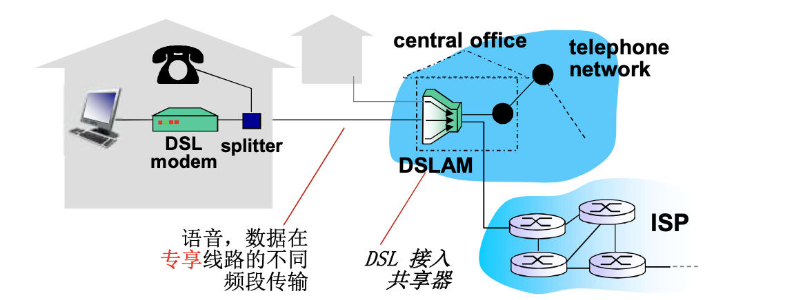
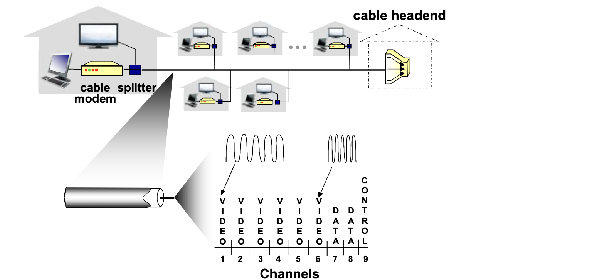
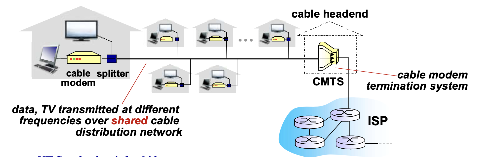
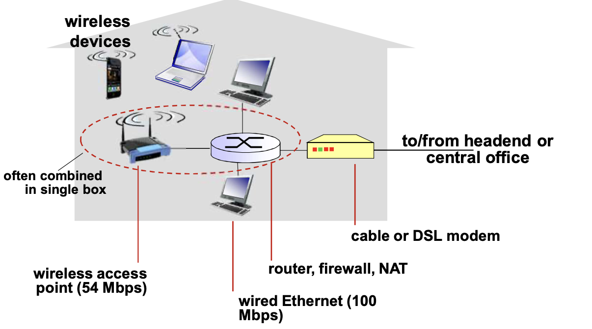
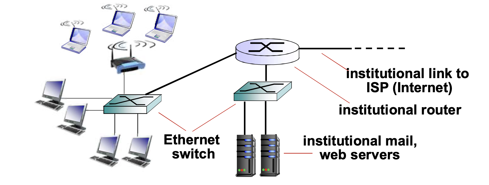

# 📘 1.4 接入网和物理媒体 (Access Networks and Physical Media)

> 来源说明：计算机网络-郑老师-第1章 1.4节 | 本节涵盖：住宅/企业/无线接入方式，以及双绞线、同轴电缆、光纤、无线链路等物理媒体

---

## 🧠 核心概念总览（严格按原文顺序）

* [*知识点1: 接入网络和物理媒体的引入问题*](#id1)
* [*知识点2: 住宅接入：调制解调器（Modem）*](#id2)
* [*知识点3: 接入网：数字用户线路（DSL）*](#id3)
* [*知识点4: 接入网：线缆网络（Cable Network）*](#id4)
* [*知识点5: 接入网：线缆网络/HFC详解*](#id5)
* [*知识点6: 住宅接入：电缆模式*](#id6)
* [*知识点7: 接入网：家庭网络*](#id7)
* [*知识点8: 企业接入网络（Ethernet）*](#id8)
* [*知识点9: 无线接入网络*](#id9)
* [*知识点10: 物理媒体概述*](#id10)
* [*知识点11: 导引型媒体：双绞线（TP）*](#id11)
* [*知识点12: 导引型媒体：同轴电缆与光纤*](#id12)
* [*知识点13: 非导引型媒体：无线链路*](#id13)

---

## ✅ 知识点1: 接入网络和物理媒体的引入问题

**理论**
* **核心问题**：怎样将端系统和边缘路由器连接？
* **接入网络的分类**：
  * **住宅接入网络**：家庭用户接入
  * **单位接入网络**：学校、公司等机构接入
  * **无线接入网络**：移动设备无线接入
* **接入网络的关键指标**：
  * 接入网络的<b>带宽（bits per second）</b>是多少？
  * **共享**还是**专用**？
* **接入网的作用**：把边缘网络接入到网络核心

**注意点**
* > 📋 **术语提醒**：接入网（Access Network）是连接端系统到边缘路由器的"最后一公里"
* > 💡 **理解技巧**：接入网就像从家到主干道的连接道路，决定了用户能使用的实际带宽

---

## ✅ 知识点2: 住宅接入：调制解调器（Modem）

**理论**
* **Modem的工作原理**：
  * 将上网数据**调制**加载音频信号上，在电话线上传输
  * 在局端将其中的数据**解调**出来；反之亦然
* **调制方式**：
  * 调频
  * 调幅
  * 调相位
  * 综合调制
* **拨号调制解调器的特点**：
  * **速率**：50 Kbps的速率直接接入路由器（通常更低）
  * **不能同时上网和打电话**：不能总是在线
  * **带宽很窄**

**注意点**
* > 📋 **术语提醒**：Modem是Modulator（调制器）和Demodulator（解调器）的组合词
* > ⚠️ **限制**：拨号上网已经被淘汰，但在了解接入网发展史时仍有参考价值

---

## ✅ 知识点3: 接入网：数字用户线路（DSL）

**理论**
* **DSL（Digital Subscriber Line）的基本架构**：
  * 家庭 → 电话线 → DSLAM（DSL接入复用器）→ ISP/电话网
  * **DSLAM（Digital Subscriber Line Access Multiplexer）**：DSL接入共享器
* **DSL的工作原理**：
  * **采用现存的到交换局DSLAM的电话线**
  * **语音和数据在专享线路的不同频段传输**
  * DSL线路上的数据被传到互联网
  * DSL线路上的语音被传到电话网
  
* **DSL的速率特点**：
  * **上行（Upload）**：< 2.5 Mbps（typically < 1 Mbps）
  * **下行（Download）**：< 24 Mbps（typically < 10 Mbps）

**注意点**
* > 💡 **关键区别**：与Modem不同，DSL可以同时上网和打电话，因为使用了不同的频段

---

## ✅ 知识点4: 接入网：线缆网络（Cable Network）

**理论**
* **有线电视信号线缆的双向改造**：
  * 有线电视网络原本是单向广播，需要改造为双向传输才能支持上网
  
* **FDM（频分多路复用）的应用**：
  * 在不同频段传输不同信道的数据
  * 包括数字电视和上网数据（上下行）
* **信道分配示例**：
  * Channels 1-6：VIDEO（视频）
  * Channels 7-8：DATA（数据）
  * Channel 9：CONTROL（控制）

**注意点**
* 🔄 **知识关联**：线缆网络使用FDM技术与电路交换中的FDM原理相同，但用于接入网场景

---

## ✅ 知识点5: 接入网：线缆网络/HFC详解

**理论**
* **HFC（Hybrid Fiber Coax）**：混合光纤同轴电缆
  * 把光纤的高速传输能力和同轴电缆的成熟入户网络结合起来的一种接入网技术
* **架构组成**：
  * 家庭 → Cable Modem（线缆解调器）→ Splitter（分离器）→ 同轴电缆 → 光纤节点→ 光纤干线 →Cable Headend（线缆头端）→ CMTS（和所有用户的 Cable Modem 通信，管理带宽分配） → ISP
  * **CMTS（Cable Modem Termination System）**：线缆调制解调器端接系统
  
* **速率特点**：
  * **非对称**：最高30 Mbps的下行传输速率，2 Mbps上行传输速率
* **网络拓扑**：
  * 线缆和光纤网络将每个家庭用户接入到ISP路由器
  * **各用户共享到线缆头端的接入网络**
* **与DSL的关键区别**：
  * **DSL**：每个用户一个**专用线路**到CO（Central Office）
  * **Cable**：用户**共享**接入网络

**注意点**
* ⚠️ **重要区别**：Cable是共享介质，用户数增多时实际带宽会下降；DSL是专用线路，带宽相对稳定

---

## ✅ 知识点6: 住宅接入：电缆模式

**理论**
- 这是基于 **HFC（光纤同轴混合网）** 的电缆接入模式，通过光纤将信号传输到光纤节点，再利用同轴电缆分配到户，为住宅和商业用户提供宽带、电视和语音等业务接入。
- 本质和HFC是同一个东西

---

## ✅ 知识点7: 接入网：家庭网络

**理论**
* **典型家庭网络架构**：

* **组件说明**：
  * **Router（路由器）**：连接不同网络
  * **Firewall（防火墙）**：安全保护
  * **NAT（Network Address Translation）**：网络地址转换
  * **Wired Ethernet**：有线以太网（100 Mbps）
  * **Wireless Access Point**：无线接入点（54 Mbps）
* **集成特点**：often combined in single box（通常集成在一个设备中）

---

## ✅ 知识点8: 企业接入网络（Ethernet）

**理论**
* **使用场景**：经常被企业或者大学等机构采用
* **传输速率演进**：
  * 10 Mbps → 100 Mbps → 1 Gbps → 10 Gbps
* **连接特点**：
  * 现在，端系统经常**直接接到以太网络交换机上**
* **架构示意**：
  * 机构内服务器/主机 → Ethernet Switch（以太网交换机）→ Institutional Router（机构路由器）→ ISP
  

---

## ✅ 知识点9: 无线接入网络

**理论**
* **无线接入的基本特点**：
  * 各无线端系统**共享无线接入网络**（端系统到无线路由器）
  * 通过**基站（Base Station）**或者叫**接入点（Access Point）**
* **无线LANs（局域网）**：
  * **范围**：建筑物内部（100 ft / 约30米）
  * **标准**：802.11b/g（WiFi）
  * **速率**：11 Mbps, 54 Mbps传输速率
* **广域无线接入（Wide-area Wireless）**：
  * **提供方**：电信运营商（cellular）
  * **范围**：10's km（数十公里）
  * **速率演进**：
    * **3G**：1到10 Mbps
    * **4G/LTE（Long Term Evolution）**：10 Mbps级别
    * **5G**：数Gbps

---

## ✅ 知识点10: 物理媒体概述

**理论**
* **Bit的定义**：在发送-接收对间传播的数据单元
* **物理链路（Physical Link）**：连接每个发送-接收对之间的物理媒体
* **物理媒体的分类**：

| 类型 | 英文 | 特点 |
|------|------|------|
| 导引型媒体 | Guided Media | 信号沿着固体媒介被导引：同轴电缆、光纤、双绞线 |
| 非导引型媒体 | Unguided Media | 开放的空间传输电磁波或者光信号，在电磁或者光信号中承载数字数据 |

**注意点**
* 💡 **理解技巧**：导引型媒体就像有轨道的列车，非导引型媒体就像自由飞行的飞机

---

## ✅ 知识点11: 导引型媒体：双绞线（TP）

**理论**
* **双绞线（Twisted Pair, TP）的结构**：
  * **两根绝缘铜导线拧合**
* **绞合的目的**：
  * 减少电磁干扰
  * 降低信号串扰
* **分类标准**：

| 类别 | 速率 | 应用 |
|------|------|------|
| 5类（Cat 5） | 100 Mbps以太网，Gbps千兆位以太网 | 快速以太网 |
| 6类（Cat 6） | 10 Gbps万兆以太网 | 高速网络 |

**注意点**
* 📋 **术语提醒**：
  * Cat 5 / Cat 6：Category 5 / Category 6，双绞线的分类标准
  * Gbps（Gigabits per second）：千兆比特每秒

---

## ✅ 知识点12: 导引型媒体：同轴电缆与光纤

**理论**
* **同轴电缆（Coaxial Cable）**：
  * **结构**：两根同轴的铜导线
  * **传输特性**：双向传输
  * **类型**：
    * **基带电缆（Baseband）**：电缆上一个单个信道，如Ethernet
    * **宽带电缆（Broadband）**：电缆上有多个信道，如HFC
* **光纤和光缆（Optical Fiber）**：
  * **传输原理**：**光脉冲**，每个脉冲表示一个bit，在**玻璃纤维**中传输
  * **高速特性**：点到点的高速传输（如10 Gbps - 100 Gbps传输速率）
  * **低误码率**：在两个中继器之间可以有很长的距离，**不受电磁噪声的干扰**
  * **安全性**：难以被窃听

**注意点**
* 💡 **对比记忆**：
  * 同轴电缆：金属导体传输电信号
  * 光纤：玻璃纤维传输光信号
* 📋 **术语提醒**：
  * Baseband：基带，单一信道传输
  * Broadband：宽带，多信道传输

---

## ✅ 知识点13: 非导引型媒体：无线链路

**理论**
* **无线链路的基本原理**：
  * 开放空间传输**电磁波**，携带要传输的数据
  * **无需物理"线缆"**
  * **双向**传输
* **传播环境效应**：
  * **反射（Reflection）**
  * **吸收（Absorption）**
  * **干扰（Interference）**
* **无线链路类型**：

| 类型 | 英文 | 速率 | 特点 |
|------|------|------|------|
| 地面微波 | Terrestrial Microwave | up to 45 Mbps channels | 远距离点对点传输 |
| 无线LAN | LAN (e.g., WiFi) | 11 Mbps, 54 Mbps, 540 Mbps... | 建筑物内部 |
| 广域无线 | Wide-area (e.g., Cellular) | 3G: ~几Mbps, 4G: 10 Mbps, 5G: 数Gbps | 电信运营商提供，数十公里范围 |
| 卫星 | Satellite | 每个信道Kbps到45 Mbps | 270 msec端到端延迟；包括同步静止卫星和低轨卫星 |

**注意点**
* ⚠️ **卫星通信的延迟问题**：270 ms的端到端延迟是一个重要特性，对于实时通信应用有影响
* 📋 **术语提醒**：
  * Geostationary：同步静止卫星
  * LEO（Low Earth Orbit）：低轨卫星

---
