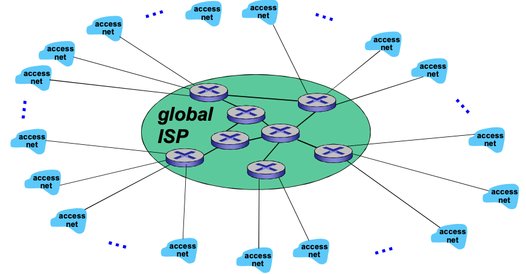
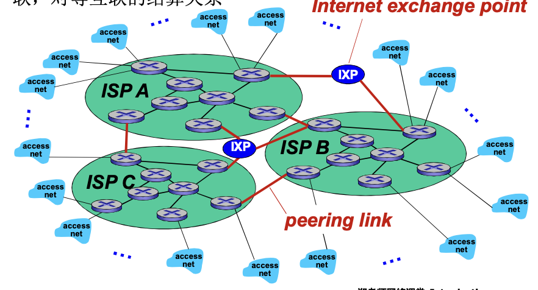
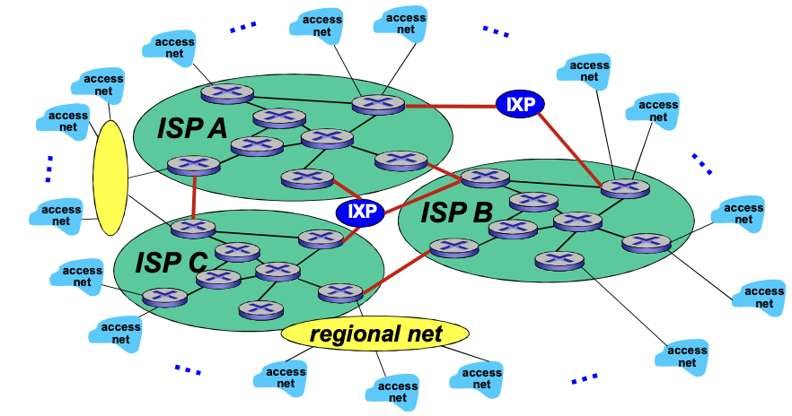
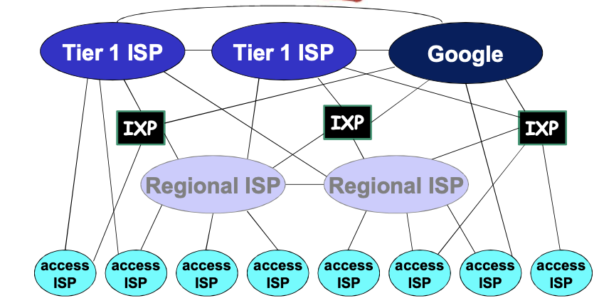

# 📘 1.5 Internet结构和ISP (Internet Structure and ISP)

> 来源说明：计算机网络-郑老师-第1章 1.5节 | 本节涵盖：Internet的层次化ISP结构、网络的网络、Tier-1/2/3 ISP、IXP、内容提供商网络

---

## 🧠 核心概念总览（严格按原文顺序）

* [*知识点1: 互联网络结构：网络的网络*](#id1)
* [*知识点2: ISP互联的基本问题*](#id2)
* [*知识点3: 选项1：将每两个ISPs直接相连的问题*](#id3)
* [*知识点4: 选项2：全局ISP（Global ISP）的概念*](#id4)
* [*知识点5: 竞争：多个全局ISP的出现*](#id5)
* [*知识点6: IXP与对等互联（Peering）*](#id6)
* [*知识点7: 区域网络（Regional Net）的出现*](#id7)
* [*知识点8: 内容提供商网络（Content Provider Network）*](#id8)
* [*知识点9: 网络总体的结构概览*](#id9)

---

## ✅ 知识点1: 互联网络结构：网络的网络

**理论**
* **端系统通过接入ISPs连接到互联网**：
  * 住宅、公司和大学的ISPs
* **接入ISPs相应必须是互联的**：
  * 因此任何2个端系统可相互发送分组到对方
* **导致的"网络的网络"非常复杂**：
  * 发展和演化是通过**经济的和国家的政策**来驱动的
* **研究方法**：采用渐进方法来描述当前互联网的结构

**注意点**
* 💡 **理解技巧**：Internet不是单一网络，而是无数个网络互联而成的"网络的网络"
* 📋 **术语提醒**：ISP（Internet Service Provider）互联网服务提供商

---

## ✅ 知识点2: ISP互联的基本问题

**理论**
* **核心问题**：给定数百万接入ISPs，如何将它们互联到一起？
* **问题的复杂性**：
  * 接入ISP数量巨大（数百万级别）
  * 需要保证任意两个端系统可以通信
  * 需要可扩展的互联方案

---

## ✅ 知识点3: 选项1：将每两个ISPs直接相连的问题

**理论**
* **方案描述**：将每两个ISPs直接相连
* **问题**：**不可扩展**
* **复杂度分析**：需要<b>O(N²)</b>连接
  * N个ISP两两相连，连接数随N平方增长
  * 当N=百万级别时，连接数将爆炸性增长

---

## ✅ 知识点4: 选项2：全局ISP（Global ISP）的概念

**理论**
* **方案描述**：将每个接入ISP都连接到**全局ISP**（全局范围内覆盖）
* **经济关系**：
  * **客户ISPs**和**提供者ISPs**有经济合约
  * 接入ISP向全局ISP付费获得互联网连接
* 示意图：

---

## ✅ 知识点5: 竞争：多个全局ISP的出现

**理论**
* **商业逻辑**：如果全局ISP是可行的业务，那会有竞争者
  * 有利可图，一定会有竞争
* **结果**：出现多个全局ISP（如ISP A、ISP B、ISP C）
* **新的问题**：多个全局ISP之间也需要互联

---

## ✅ 知识点6: IXP与对等互联（Peering）

**理论**
* **合作需求**：通过ISP之间的合作可以完成业务的扩展
* **对等互联（Peering）**：
  * 2个ISP对等互接
  * **不涉及费用结算**
* **IXP（Internet Exchange Point）**：
  * 互联网交换点
  * 多个对等ISP互联互通之处
  * 通常不涉及费用结算
* **结算关系**：
  * 对等接入（Peering）：平等互联，不付费
  * 客户-提供者：客户向提供者付费

示意图：

---

## ✅ 知识点7: 区域网络（Regional Net）的出现

**理论**
* **业务细分**：全球接入和区域接入的业务细分
* **区域网络（Regional Net）的作用**：
  * 将接入ISPs连接到全局ISPs
  * 在接入ISP和全局ISP之间增加中间层
* **架构演进**：
  * 接入ISP → 区域网络 → 全局ISP
* 示意图：

---

## ✅ 知识点8: 内容提供商网络（Content Provider Network）

**理论**
* **内容提供商**：Internet Content Providers（如Google、Microsoft、Akamai）
* **构建动机**：
  * 将它们的服务、内容更加靠近端用户
  * 向用户提供更好的服务
  * 减少自己的运营支出
  * 减少对ISP的依赖
* **实现方式**：
  * 部署自己的网络
  * 绕过第一层ISP和区域ISPs
  * 通常私有网络之间用专网连接

---

## ✅ 知识点9: 网络总体结构概览

**理论**
* **网络结构特点**：
  * **POP(Point of Presence)**: 高层ISP面向客户网络的接入点，涉及费用结算
    * 如一个底层ISP接入到多个高层ISP， 多宿(multi home)
  * **对等接入**: 两个ISP对等互接， 不涉及费用
    * 一般通过**IXP**互接

  * **ICP**: 可以自己部署自己的专用网络，同时也可以和各级别ISP链接

---

