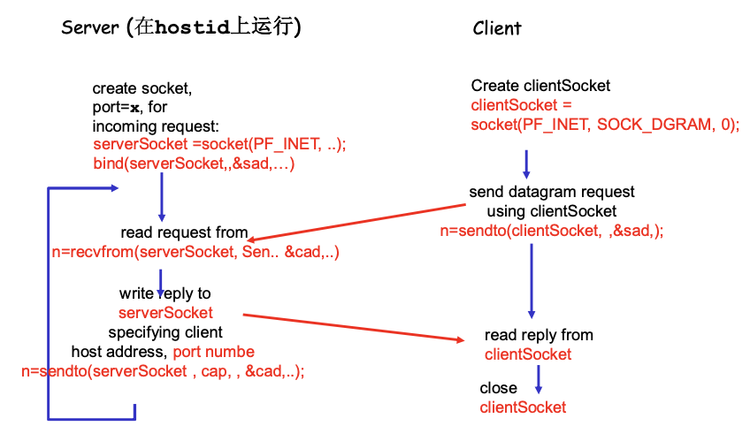

# 📘 2.9 UDP 套接字编程 (UDP Socket Programming)

> 来源说明：计算机网络-郑老师-第2章 | 本节涵盖：UDP套接字特点、客户端-服务器交互、C语言示例

---

## 🧠 核心概念总览（严格按原文顺序）

* [*知识点1: UDP套接字特点*](#id1)
* [*知识点2: 进程视角看UDP服务*](#id2)
* [*知识点3: C/S socket交互-UDP*](#id3)
* [*知识点4: C客户端示例(UDP)*](#id4)
* [*知识点5: C服务器示例(UDP)*](#id5)

---

<a id="id1"></a>
## ✅ 知识点1: UDP套接字特点

**理论**
* **UDP：在客户端和服务器之间没有连接**
  * 没有握手
  * 发送端在每一个报文中明确地指定目标的IP地址和端口号
  * 服务器必须从收到的分组中提取出发送端的IP地址和端口号
* **UDP：传送的数据可能乱序，也可能丢失**

---

<a id="id2"></a>
## ✅ 知识点2: 进程视角看UDP服务

**理论**
* **UDP为客户端和服务器提供不可靠的字节组的传送服务**
* **特点**
  * 无需建立连接，省去了建立连接时间，适合事务性的应用
  * 不做可靠性的工作，例如检错重发，适合那些对实时性要求比较高而对正确性要求不高的应用
    * 因为为了实现可靠性（准确性、保序等），必须付出时间代价（检错重发）
  * 没有拥塞控制和流量控制，应用能够按照设定的速度发送数据
    * 而在TCP上面的应用，应用发送数据的速度和主机向网络发送的实际速度是不一致的，因为有流量控制和拥塞控制

---

<a id="id3"></a>
## ✅ 知识点3: C/S socket交互-UDP

**理论**

**交互流程图**


**关键区别**
* **TCP**：需要listen()和accept()，建立连接后才能通信
* **UDP**：没有连接建立过程，直接发送/接收数据报
* **UDP需要显式指定地址**：每次发送都需要指定目标地址，接收时需要获取源地址

---

<a id="id4"></a>
## ✅ 知识点4: C客户端示例(UDP)

**理论**

**完整代码示例**
```cpp
/* client.c */
void main(int argc, char *argv[])
{
    struct sockaddr_in sad;    /* structure to hold an IP address */
    int clientSocket;          /* socket descriptor */
    struct hostent *ptrh;      /* pointer to a host table entry */
    char Sentence[128];
    char modifiedSentence[128];
    
    host = argv[1]; 
    port = atoi(argv[2]);
    
    /* Create client socket (SOCK_DGRAM for UDP), 没有连接到服务器 */
    clientSocket = socket(PF_INET, SOCK_DGRAM, 0);
    
    /* determine the server's address */
    memset((char *)&sad, 0, sizeof(sad));     /* clear sockaddr structure */
    sad.sin_family = AF_INET;                /* set family to Internet */
    sad.sin_port = htons((u_short)port);
    ptrh = gethostbyname(host);              /* Convert host name to IP address */
    memcpy(&sad.sin_addr, ptrh->h_addr, ptrh->h_length);
    
    /* Get input stream from user */
    gets(Sentence);
    
    addr_len = sizeof(struct sockaddr);
    
    /* Send line to server (必须指定服务器地址) */
    n = sendto(clientSocket, Sentence, strlen(Sentence)+1, 
               (struct sockaddr *) &sad, addr_len);
    
    /* Read line from server */
    n = recvfrom(clientSocket, modifiedSentence, sizeof(modifiedSentence),
                 (struct sockaddr *) &sad, &addr_len);
    
    printf("FROM SERVER: %s\n", modifiedSentence);
    
    /* Close connection */
    close(clientSocket);
}
```

**与TCP客户端的关键区别**
1. **socket类型**：`SOCK_DGRAM` 代替 `SOCK_STREAM`
2. **无connect()**：UDP不需要建立连接
3. **使用sendto()/recvfrom()**：代替write()/read()，需要显式指定地址
4. **需要维护地址长度**：`addr_len = sizeof(struct sockaddr)`

---

<a id="id5"></a>
## ✅ 知识点5: C服务器示例(UDP)

**理论**

**完整代码示例**
```cpp
/* server.c */
void main(int argc, char *argv[])
{
    struct sockaddr_in sad;    /* structure to hold an IP address */
    struct sockaddr_in cad;    /* client address */
    int serverSocket;          /* socket descriptor */
    struct hostent *ptrh;      /* pointer to a host table entry */
    char clientSentence[128];
    char capitalizedSentence[128];
    
    port = atoi(argv[1]);
    
    /* Create welcoming socket at port & bind a local address */
    serverSocket = socket(PF_INET, SOCK_DGRAM, 0);
    memset((char *)&sad, 0, sizeof(sad));    /* clear sockaddr structure */
    sad.sin_family = AF_INET;                /* set family to Internet */
    sad.sin_addr.s_addr = INADDR_ANY;       /* set the local IP address */
    sad.sin_port = htons((u_short)port);    /* set the port number */
    bind(serverSocket, (struct sockaddr *)&sad, sizeof(sad));
    
    while(1) {
        /* Receive messages from clients (需要获取客户端地址) */
        n = recvfrom(serverSocket, clientSentence, sizeof(clientSentence), 0,
                     (struct sockaddr *) &cad, &addr_len);
        
        /* capitalize Sentence and store the result in capitalizedSentence */
        // ... 处理逻辑 ...
        
        /* Write out the result to socket (需要指定客户端地址) */
        n = sendto(serverSocket, capitalizedSentence, strlen(capitalizedSentence)+1,
                   (struct sockaddr *) &cad, addr_len);
        
    }  /* End of while loop, loop back and wait for another client */
}
```

**与TCP服务器的关键区别**
1. **socket类型**：`SOCK_DGRAM` 代替 `SOCK_STREAM`
2. **无listen()和accept()**：UDP不需要监听和接受连接
3. **使用recvfrom()/sendto()**：代替read()/write()，需要处理客户端地址
4. **单个socket服务所有客户端**：不像TCP需要为每个客户端创建新socket
5. **需要获取客户端地址**：`recvfrom()`的`&cad`参数获取客户端地址，用于`sendto()`回复

---

## 🔑 核心要点总结
1. **UDP特点**：无连接、无握手、数据可能乱序或丢失、不可靠传输
2. **UDP优势**：无需建立连接（省时间）、无拥塞控制（速度可控）、开销小
3. **UDP适用场景**：实时性要求高（音视频）、事务性应用（DNS）、对丢包容忍的应用
4. **UDP vs TCP**：UDP发送需显式指定地址，TCP通过连接自动管理
5. **关键函数**：`sendto()`/`recvfrom()` 代替 `write()`/`read()`，需要处理地址结构

## 📌 考试速记版
* **UDP核心特点**：无连接、无可靠保证、无拥塞控制、低开销
* **vs TCP**：
  * TCP：面向连接、可靠、字节流、拥塞控制
  * UDP：无连接、不可靠、数据报、无拥塞控制
* **UDP适用**：实时音视频、DNS、在线游戏、IoT
* **关键函数**：`socket(SOCK_DGRAM)`、`sendto()`、`recvfrom()`、`bind()`
* **地址处理**：UDP需每次显式指定/获取地址，TCP通过连接自动管理

## 🔍 TCP vs UDP套接字编程对比表

| 特性 | TCP | UDP |
|------|-----|-----|
| **socket类型** | `SOCK_STREAM` | `SOCK_DGRAM` |
| **连接建立** | 需要`connect()`（客户端）/`listen()+accept()`（服务器） | 无需建立连接 |
| **发送数据** | `write()` / `send()` | `sendto()`（需指定目标地址） |
| **接收数据** | `read()` / `recv()` | `recvfrom()`（获取源地址） |
| **服务器模型** | 多socket（welcome+connection） | 单socket服务所有客户端 |
| **可靠性** | 可靠传输，自动重传 | 不可靠，可能丢包乱序 |
| **拥塞控制** | 有 | 无 |
| **开销** | 大（连接管理） | 小（无连接管理） |

**记忆口诀**：UDP无连接速度快，sendto recvfrom要地址，无listen无accept，一个socket管全部，实时应用最适合
