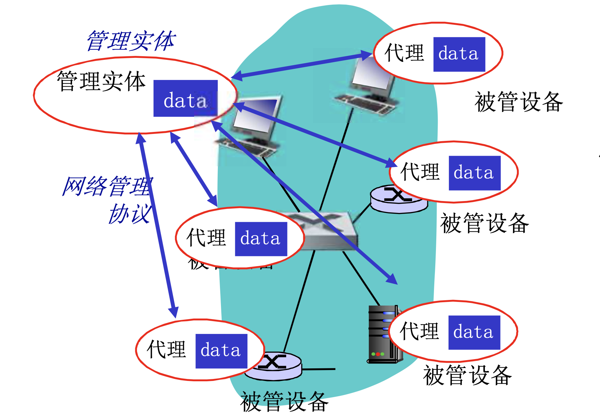
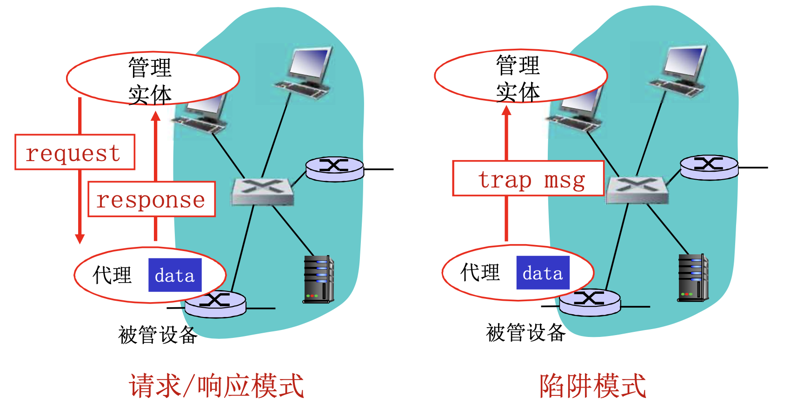
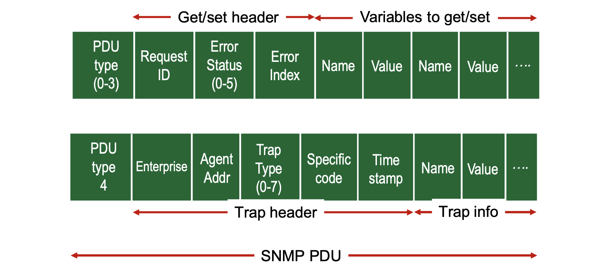

# 📘 5.7 网络管理和SNMP (Network Management and SNMP)

> 来源说明：计算机网络-郑老师 第5.7节 | 本节涵盖：网络管理的定义与五大功能、SNMP协议架构、报文类型与PDU格式 | 标注"略"，内容相对简略

---

## 🧠 核心概念总览（严格按原文顺序）

- [*知识点1: 什么是网络管理*](#id1)
- [*知识点2: 网络管理的五大功能*](#id2)
- [*知识点3: 网络管理架构*](#id3)
- [*知识点4: SNMP协议概述*](#id4)
- [*知识点5: SNMP报文类型*](#id5)
- [*知识点6: SNMP PDU格式*](#id6)

---

## ✅ 知识点1: 什么是网络管理

- <b>网络管理(Network Management)</b>的对象：
  - 自治系统(`autonomous systems, aka "network"`)：1000多个相互的软件和硬件部件
  - 其他复杂系统也需要被监视和控制：如喷气飞机、核电站
- **网络管理的定义**：
  - 包括了硬件、软件和人类元素的**设置、综合和协调**
  - 以便**监测、测试、轮询、配置、分析、评价和控制**网络和网元资源
  - 用合理的成本满足**实时性、运行能和服务质量**的要求

- > ⚠️ **管理的本质**：网络管理不仅是"看"，而是"监测+控制+优化"的闭环。

---

## ✅ 知识点2: 网络管理的五大功能

- **网络管理的5大功能**（ISO定义的网络管理功能域，FCAPS模型）：
  1. **性能管理(Performance Management)**：
     - 性能（利用率、吞吐量）量化、测量、报告、分析和控制不同网络部件的性能
     - 涉及部件：单独部件（网卡、协议实体）、端到端的路径
     - **性能管理为长期监测设备性能**
  2. **故障管理(Fault Management)**：
     - 记录、监测和响应故障
     - **突然发生的强度大的性能降低**，强调对故障的响应
  3. **配置管理(Configuration Management)**：
     - 跟踪设备的配置，管理设备配置信息
  4. **账户管理/计费管理(Account Management)**：
     - 定义、记录和控制用户和设备访问网络资源
     - 限额使用、给予使用的收费，以及分配资源访问权限
  5. **安全管理(Security Management)**：
     - 定义安全策略，控制对网络资源的使用

- > ⚠️ **性能 vs 故障的区别**：性能管理是**

---

## ✅ 知识点3: 网络管理架构

- <b>网络管理架构(Network Management Architecture)</b>的核心要素：
  - **管理实体(Manager)**：网络管理系统(NMS)的核心，负责发出管理请求
  - **被管设备(Managed Device)**：被管理的网络设备（路由器、交换机、服务器等）
  - **代理(Agent)**：运行在被管设备上的软件模块，负责收集本地数据并响应管理实体
  - **MIB (Management Information Base)**：管理信息库——被管设备的数据被收集在此，以结构化方式组织
- **管理数据流向**：
  - 管理实体 → 代理 → 被管设备 → 代理 → MIB → 返回管理实体

- > ⚠️ **MIB的本质**：MIB不是数据库软件，而是**标准化的数据结构/命名空间**——用树形层次结构（OID）标识每个被管对象。

---

## ✅ 知识点4: SNMP协议概述

- **SNMP (Simple Network Management Protocol)**：`简单网络管理协议`
- **两种工作模式**：
  1. **请求/响应模式(Request/Response)**：
     - 管理实体发送 `request`，代理返回 `response`
     - 属于<b>轮询(Polling)</b>机制——管理站主动查询
  2. **陷阱模式(Trap模式)**：
     - 代理**主动**发送 `trap message`（陷阱消息）给管理实体
     - 用于异常事件的**异步报告**——设备出问题时主动"报警"
  

---

## ✅ 知识点5: SNMP报文类型

**理论**
- **SNMPv1/v2c报文类型**（管理实体↔代理）：
  - `GetRequest`：管理实体→代理："**给我数据**"
  - `GetNextRequest`：获取列表中下一个实例的数据（`(instance, next in list, block)`）
  - `GetBulkRequest`：管理实体→代理：获取**批量数据**（减少轮询开销）
  - `InformRequest`：实体→实体：给你**MIB值**（管理站之间互通）
  - `SetRequest`：实体→代理：`set MIB value` —— **修改**被管对象的值
  - `Response`：代理→实体：值，**对请求的响应**
  - `Trap`：代理→实体：**异常事件的报告**（主动告警）

- > ⚠️ **Get vs Set**：Get是只读查询；Set是写操作（修改配置）——Set权限控制是安全关键。
- > ⚠️ **Trap的独特性**：Trap不需要Request触发，是代理**主动推送**——用于实时告警。
- > 💡 **记忆技巧**："Get三兄弟（Get/GetNext/GetBulk）来查，Set来改，Response来回，Trap来报"

---

## ✅ 知识点6: SNMP PDU格式

- **SNMP PDU (Protocol Data Unit)** 分为两种类型：
  1. **Get/Set 类型 PDU**（Type 0-3）：
     - `PDU type` (0-3)
     - `Request ID`
     - `Error Status`
     - `Error Index`
     - `Name, Value, ...`（变量绑定列表，Variable Bindings）
     - 包含：`Get/set header` + `Variables to get/set`
  2. **Trap 类型 PDU**（Type 0-7）：
     - `PDU type` (0-7) —— 注意Trap用不同的PDU类型编号
     - `Enterprise`（设备厂商标识）
     - `Agent Addr`（代理地址）
     - `Trap Type` (0-6) —— 预定义陷阱类型
     - `Specific code`（特定代码）
     - `Time stamp`
     - `Name, Value, ...`
     - 包含：`Trap header` + `Trap Info`
- **SNMP PDU的整体结构**：统一封装在SNMP消息中

- > ⚠️ **Trap PDU的特殊性**：Trap使用独立的PDU格式（不同于Get/Set），包含Enterprise和Trap Type等告警专属字段。
- > 💡 **理解技巧**：Get/Set PDU像"标准申请表"（请求ID+错误码+要查的项）；Trap PDU像"事故报告单"（厂商+地址+事故类型+时间）。

---

## 🔑 核心要点总结

1. **网络管理五大功能**：性能、故障、配置、计费、安全（FCAPS）。性能管理侧重长期监测，故障管理侧重突发响应。
2. **SNMP架构**：Manager（管理站）↔ Agent（代理，在被管设备上）↔ Managed Device；数据存储在MIB中。
3. **SNMP两种模式**：请求/响应（轮询查询）和 Trap（代理主动告警）。
4. **SNMP报文**：Get三兄弟（Get/GetNext/GetBulk）查数据，Set改数据，Response响应，Trap主动报告异常。
5. **SNMP PDU**：Get/Set用标准PDU（Request ID+Error+变量绑定）；Trap用独立PDU（含Enterprise+Trap Type等告警字段）。

---

## 📌 考试速记版

- **关键机制**：
  - FCAPS五维：Fault(故障) / Configuration(配置) / Accounting(计费) / Performance(性能) / Security(安全)
  - SNMP架构：Manager + Agent + MIB
  - SNMP模式：轮询(Request/Response) + 告警(Trap)
  - SNMP报文：Get/GetNext/GetBulk/Set → Response；Trap主动上报

- **易混淆概念对比**：
  - 性能管理 vs 故障管理：前者长期监测（日常），后者突发响应（急诊）
  - Request/Response vs Trap：前者被动轮询（你问我答），后者主动推送（有事我报）
  - Get vs Set：前者只读查询，后者写操作修改配置
  - GetNext vs GetBulk：前者逐个遍历列表，后者批量获取（效率更高）

- **常见考试陷阱**：
  - SNMP是**应用层协议**（运行在UDP之上，端口161/162），不是网络层或传输层
  - Trap使用**UDP 162端口**，普通操作使用**UDP 161端口**
  - SNMPv1安全性差（community string明文）；SNMPv3引入加密和认证
  - MIB是**逻辑命名空间**（树形OID结构），不是物理数据库
  - GetBulk是**SNMPv2新增**，v1没有此功能

**记忆口诀**：
> "网络管理FCAPS，性能长期故障急；SNMP架构Man-Agent-MIB，轮询Trap两模式；Get三兄弟查数据，Set来改Trap报异；PDU格式分两种，Get/Set标准Trap独立！"

---