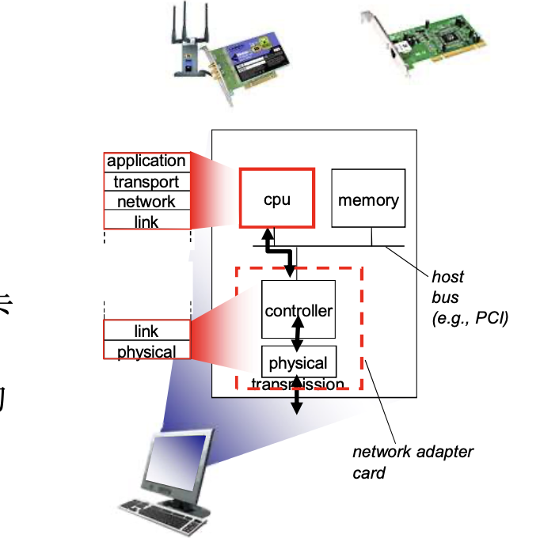
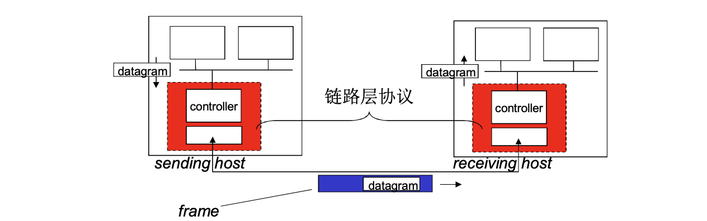

# 📘 6.1 引论和服务 (Introduction and Services)

> 来源说明：计算机网络教材（郑老师）第6.1节 | 本节涵盖：链路层的功能定位、核心术语、链路层服务类型及其实现机制

---

## 🧠 核心概念总览（严格按原文顺序）

- [*知识点1: 链路层的定位*](#id1)
- [*知识点2: 节点与链路*](#id2)
- [*知识点3: 帧——链路层协议数据单元*](#id3)
- [*知识点4: 链路层的连接方式*](#id4)
- [*知识点5: 链路层：上下文传输*](#id12)
- [*知识点6: 链路层服务的总体框架*](#id5)
- [*知识点7: 链路层服务：成帧与链路接入*](#id6)
- [*知识点8: 链路层服务：可靠传输*](#id7)
- [*知识点9: 链路层服务：流量控制*](#id8)
- [*知识点10: 链路层服务：差错检测*](#id9)
- [*知识点11: 链路层服务：差错纠正*](#id10)
- [*知识点12: 链路层服务：半双工与全双工*](#id11)
- [*知识点13: 链路层的实现位置*](#id13)
- [*知识点14: 适配器通信机制*](#id14)

---

## ✅ 知识点1: 链路层的定位

- 网络层解决的是**一个网络如何到达另外一个网络**的路由问题
- 链路层解决的是**在一个网络内部**，如何由一个节点（主机或路由器）到达**相邻节点**的传输问题
- 链路层提供的是**点到点传输层功能**
- 数据链路层负责从一个节点通过链路将（帧中的）数据报发送到**相邻的物理节点**（一个子网内部的两个节点）

> ⚠️ **关键区分**：
  > - 网络层负责**端到端**：源主机→目的主机，跨多台路由器、多条链路，全程整条路径，屏蔽中间网络
  > - 链路层负责**点到点**：只连接紧邻两台设备，一段物理链路，中间无转发

> 🔄 **知识关联**：第3章已学过可靠数据传输(`RDT`)，链路层可靠性是其局部应用

---

## ✅ 知识点2: 节点与链路

**基本概念**
- **节点**（nodes）：主机和路由器是节点，网桥和交换机也是节点
  > 📋 **术语提醒**：node ≠ host，交换机/网桥都是node但不是host
- **链路**（links）：沿着通信路径，连接相邻节点通信信道的传输介质
  - 有线链路
  - 无线链路
  - 局域网链路——共享性链路

> - ⚠️ **关键区分**：链路不等于物理线路，而是**相邻节点间的通信信道**概念
> -  💡 **理解技巧**：一条端到端路径由多段链路串联而成，每段链路可运行不同的链路层协议

---

## ✅ 知识点3: 帧——链路层协议数据单元

**基本概念**
- 链路层协议数据单元称为**帧**（frame）
- 帧的功能：**封装数据报**，将网络层传下来的IP数据报包装成链路层帧格式
- 帧的结构包含：帧头(header) + 数据部分(IP数据报) + 帧尾(trailer)

> - ⚠️ **关键区分**：帧(frame)是链路层PDU，分组/数据报(packet/datagram)是网络层PDU

---

## ✅ 知识点4: 链路层的连接方式

1. **WAN（广域网）**：
    - 网络形式采用**点到点链路**
    - 特点：带宽大、距离远（延迟大）→ **带宽延迟积大**
    - 如果采用多点连接方式：
      - 物理代价：广域网多点距离远，连在一起物理代价高
      - 竞争方式：延迟大容易多点冲突，一旦冲突代价大
      - 令牌等协调方式：协调节点发送代价大
    - 点到点链路的链路层服务实现非常简单：**封装和解封装**，没有寻址因为只有你和我

2. **LAN（局域网）**：
    - 一般采用**多点连接方式**
    - 连接节点非常方便：接到**共享型介质**（如同轴电缆）或**网络交换机**上，即可连接所有其他节点
    - 多点连接方式网络的链路层功能实现**相当复杂**：
      - **多点接入**：协调各节点对共享性介质的访问和使用
      - **竞争方式**：冲突之后的协调
      - **令牌方式**：令牌产生、占有和释放等

> 💡 **理解技巧**：点到点链路上只有两端，不需要协调谁发送；多点链路需要解决"谁先用"的问题

---

## ✅ 知识点5: 链路层：上下文传输

**传输实际工况**
- 数据报(`datagram`)在不同链路上以**不同的链路协议**传送
  - 第一跳链路：以太网
  - 中间链路：帧中继链路
  - 最后一跳：802.11（WiFi）
- 不同的链路协议提供**不同的服务**
  - e.g. 在链路层上提供（或没有）可靠数据传送

**传输类比**（帮助理解分层思想）：
- 就像从北京到上海，可能先地铁→再高铁→再出租车，每段交通工具不同，但"你"（数据报）始终是同一个
  - **旅行者** = **IP数据报**(`datagram`)
  - **交通段** = **通信链路**(`communication link`)
  - **交通模式** = **链路层协议**(`link layer protocol`)
    - e.g. 轿车、飞机、火车
  - **票务代理** = **路由算法**(`routing algorithm`)
    - 负责规划全程路线（网络层功能）

> - ⚠️ **关键区分**：类比中，旅行者不变（数据报不变），但交通工具（链路协议）每段都可能不同
> - 🔄 **知识关联**：第4章学过IP数据报在不同链路上的封装变化，但IP头部保持不变

---

## ✅ 知识点6: 链路层服务的总体框架

**服务概览**
- 链路层提供的服务是**一般化**的，**不是所有链路层都提供全部服务**
  > - ⚠️ 如**以太网**就没有实现可靠数据传输
  > - ⚠️ 802.11 则是可靠传输
- 一个特定的链路层协议**只提供其中一部分服务**
- 具体提供哪些服务，取决于链路的特点（出错率、速率、拓扑等）

**链路层核心服务清单**：
1. 成帧与链路接入
2. 可靠数据传输
3. 流量控制
4. 差错检测
5. 差错纠正
6. 半双工/全双工

> - ⚠️ **关键区分**：链路层服务是**可裁剪的菜单**，不是**固定套餐**
> - 💡 **理解技巧**：光纤链路出错率低→不需要链路层可靠性；无线链路出错率高→需要链路层可靠性

---

## ✅ 知识点7: 链路层服务：成帧与链路接入

**服务内容**
- **成帧**(`framing`)：将数据报封装在帧中，加上**帧头**(`header`)和**帧尾部**(`trailer`)
- **链路接入**(`link access`)：
  - 如果采用**共享性介质**，需要获得信道访问权(`channel access`)
  - 在帧头部使用**MAC（Media Access Control）地址**（物理地址）来标示源和目的
    - **MAC地址不同于IP地址**

> - ⚠️ **关键区分**：MAC地址是物理地址（链路层），IP地址是逻辑地址（网络层）

> - 💡 **理解技巧**：MAC地址是"门牌号"（物理位置），IP地址是"收件人姓名"（逻辑身份）

---

## ✅ 知识点8: 链路层服务：可靠传输

**服务内容**
- 在相邻节点间（一个子网内）进行**可靠的数据传递**
- 已经在第3章学过可靠数据传输(`RDT`)的原理
- 哪些场景提供可靠/不可靠服务？：
  - **低出错率链路**（光纤、双绞线电缆）：**很少使用**链路层可靠性
    - 出错率低，没必要每帧都做差错控制，协议复杂
    - 发送端对每帧进行差错控制编码，根据反馈(ACK/NAK)做相应动作
    - 接收端进行差错控制解码，反馈给发送端
    - 在本层放弃可靠控制，由网络层或传输层做可靠性工作，或根本不做
  - **高差错链路**（无线链路802.11）：**需要进行**可靠数据传送
    - 原因：出错率高，如果链路层不做差错控制，漏出去的错误多
    - 到了上层如果需要可靠传输，总体代价会很大
    - 如不做局部恢复(`local recovery`)，总体代价大

> - ⚠️ **关键问题**：为什么在链路层和传输层都实现了可靠性？
  >   - 答：无线链路出错率高，链路层做局部恢复更快更高效；传输层做端到端保证，两者互补
> - 💡 **理解技巧**：链路层可靠性是"本地急救"，传输层可靠性是"全程保险"

---

## ✅ 知识点9: 链路层服务：流量控制

**服务内容**
- **流量控制**(`flow control`)：使得相邻的发送方和接收方节点的速度匹配
  > - ⚠️ 由于接收方的读取，处理速率比较慢导致双方速度不匹配
- 防止发送方发送速率过快，导致接收方来不及处理而丢失数据
- 是相邻节点间的局部速率协调机制

> - 💡 **理解技巧**：链路层流量控制解决"你这根网线别发太快把我冲垮"，传输层解决"别发太快把终点服务器冲垮"

---

## ✅ 知识点10: 链路层服务：差错检测

**服务内容**
- **差错检测**(`error detection`)：检测传输过程中是否出现错误
- 差错由**信号衰减**和**噪声**引起
- 接收方检测出错误后：
  - 通知发送端进行**重传**，或
  - **丢弃**该帧

> - ⚠️ **关键区分**：差错检测只发现错误，不纠正错误 → 需要配合重传机制

---

## ✅ 知识点11: 链路层服务：差错纠正

**服务内容**
- **差错纠正**(`error correction`)：接收端**检查和纠正bit错误**
- 特点：**不通过重传**来纠正错误，直接在接收端修复
- 通常比差错检测开销更大，但能避免重传延迟
- 适用于高延迟链路（如卫星通信），重传代价高的情况

>- ⚠️ **关键区分**：差错检测 + 重传 vs 差错纠正（前向纠错FEC）
      >   - 检测+重传：发现错误后通知发方重发，适合低延迟链路
      >   - 纠正：自己修复错误，不依赖重传，适合高延迟链路
>- 💡 **理解技巧**：差错纠正是"自带修复能力"，差错检测是"发现问题打电话叫人来修"

---

## ✅ 知识点12: 链路层服务：半双工与全双工

**服务内容**
- **半双工**(`half-duplex`)：链路可以双向传输，但**一次只有一个方向**
  - 类似对讲机：一方说，另一方听，不能同时说
- **全双工**(`full-duplex`)：链路可以同时双向传输
  - 类似电话：双方可以同时说话和听

---

## ✅ 知识点13: 链路层的实现位置

**核心实现位置**
- 链路层功能在**每一个主机上**实现
  - 也在**每个路由器上**
  - **交换机的每个端口上**
- 链路层功能在<b>"适配器"</b>(`adapter`)上实现
  - 又名网卡，**网络接口卡**(`NIC`, `Network Interface Card`)
  - 或者在一个**芯片组**上
- 适配器类型：
  - 以太网卡
  - 802.11网卡（无线网卡）
  - 以太网芯片组
- 实现内容：
  - 链路层功能
  - 相应的**物理层**功能
- 连接到主机的**系统总线**上
- 本质：**硬件、软件和固件的综合体**

> - ⚠️ **关键区分**：链路层不完全由硬件实现，是硬件+软件+固件的综合体
> - 💡 **理解技巧**：网卡(NIC)是链路层和物理层的"物理化身"

---

## ✅ 知识点14: 适配器通信机制

**发送方功能**：
- 在帧中**封装数据报**
- 加上**差错控制编码**
- 实现**RDT**（可靠数据传输）和**流量控制**功能
  >- ⚠️ 数据报通过网卡驱动交给网卡并封装成帧

**接收方功能**：
- **检查有无出错**
- 执行**RDT**和**流量控制**功能
- **解封装数据报**，将数据报通过系统总线交给上层（网络层）

**适配器特性**：
- 适配器是**半自治的**(`semi-autonomous`)
- 实现了**链路层和物理层**功能
- 任何网卡都是可以同时发同时接

> - ⚠️ **关键区分**：适配器是"半自治"的——它自己处理链路层和物理层事务，不完全依赖主机CPU
> - 💡 **理解技巧**：网卡像"智能邮筒"，能自己检查信封地址、贴邮票、差错校验，不需要每次问CPU

---

## 🔑 核心要点总结

1. **链路层定位**：解决相邻节点间的点到点传输，与网络层端到端路由互补
2. **核心术语**：节点(nodes)、链路(links)、帧(frame)——链路层PDU
3. **WAN vs LAN**：点到点链路简单（封装/解封装），多点链路复杂（需协调接入）
4. **六类服务**：成帧/链路接入、可靠传输、流量控制、差错检测、差错纠正、半双工/全双工——按需选择
5. **实现位置**：适配器/NIC——链路层+物理层的硬件/软件/固件综合体

---

## 📌 考试速记版

- **关键机制**：帧封装、MAC寻址、差错检测(CRC)、链路层可靠性（无线链路用）
- **易混淆概念对比**：

| 对比项 | 链路层 | 传输层 |
|--------|--------|--------|
| 可靠性范围 | 相邻节点间（局部） | 端到端（全程） |
| 流量控制范围 | 相邻节点间 | 端到端 |
| 地址 | MAC地址（物理） | 端口号 |

| 对比项 | 差错检测 | 差错纠正 |
|--------|----------|----------|
| 能力 | 发现错误 | 修复错误 |
| 开销 | 小 | 大 |
| 是否需要重传 | 是 | 否 |

- **常见考试陷阱**：
  - ❌ "链路层保证端到端可靠传输" → 链路层只保证相邻节点间可靠
  - ❌ "所有链路都提供全部服务" → 链路层服务按需裁剪
  - ❌ "MAC地址和IP地址是一回事" → MAC是物理地址，IP是逻辑地址

**记忆口诀**：链路层，管邻居，帧封装，加地址；出错低，不纠错，出错高，才重传；适配器，半自治，硬软固，三合一。
