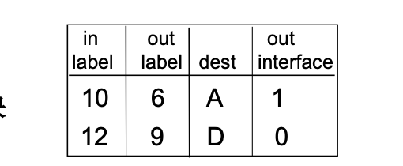
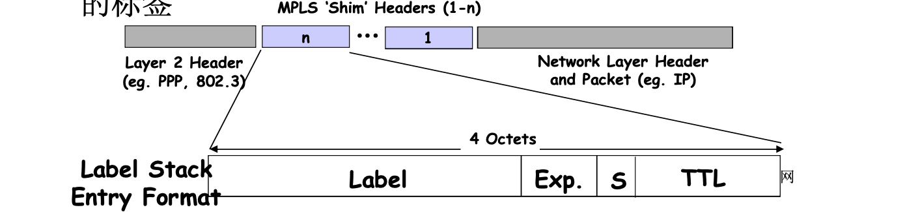
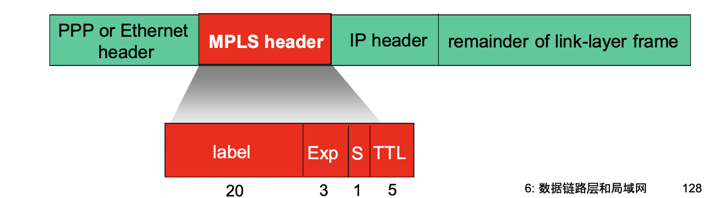
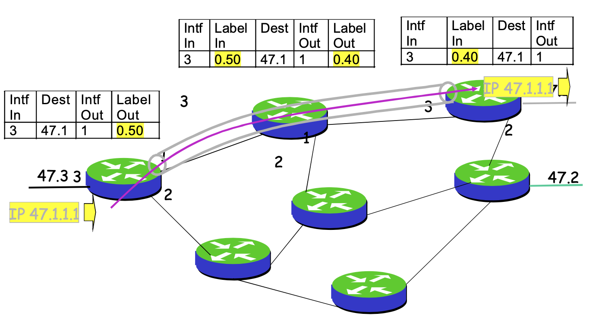
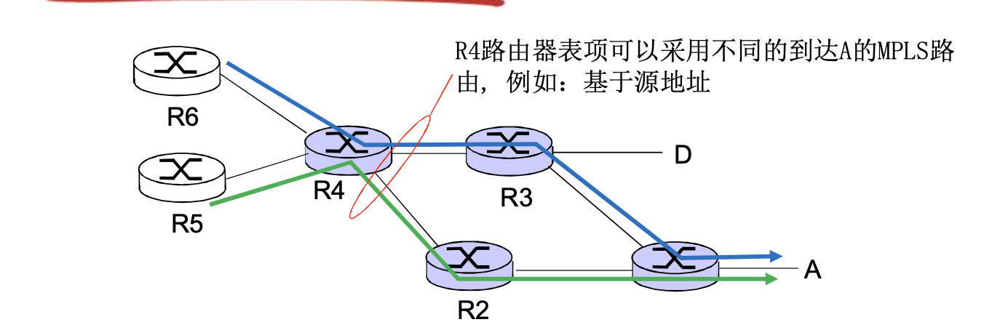

# 📘 6.5 链路虚拟化：MPLS (Link Virtualization: MPLS)

> 来源说明：计算机网络教材第6.5节 | 本节涵盖：MPLS `多协议标签交换(Multiprotocol Label Switching)` 的基本概念、标签交换机制、信令协议、与IP路由的对比及核心优势

---

## 🧠 核心概念总览（严格按原文顺序）

- [*知识点1: MPLS基本概念与链路虚拟化定位*](#id1)
- [*知识点2: 纯IP网络转发的局限性*](#id2)
- [*知识点3: MPLS标签转发机制*](#id3)
- [*知识点4: 标签交换的过程与LER角色*](#id4)
- [*知识点5: 标签封装与垫层格式*](#id5)
- [*知识点6: MPLS信令协议与标签分发机制*](#id6)
- [*知识点7: MPLS的核心优点*](#id7)
- [*知识点8: 标签交换路径(LSP)与转发表*](#id8)
- [*知识点9: 显式路由标签交换路径(ER-LSP)*](#id9)
- [*知识点10: MPLS设计初衷与高速标签转发*](#id10)
- [*知识点11: 垫层封装与协议无关性*](#id11)
- [*知识点12: 标签交换路由器(LSR)的工作机制*](#id12)
- [*知识点13: MPLS与IP路由路径对比*](#id13)
- [*知识点14: MPLS快速重新路由与弹性*](#id14)
- [*知识点15: MPLS信令协议扩展(OSPF/IS-IS与RSVP-TE)*](#id15)

---

## ✅ 知识点1: MPLS基本概念与链路虚拟化定位

**MPLS概念**
- 从 `IP网络(IP Network)` 的角度来看，`MPLS(Multiprotocol Label Switching)` 是将一组支持MPLS的网络**虚拟成链路**的技术
- MPLS并非替代IP网络，而是在现有IP网络之上构建一层**标签转发机制**
- 核心思想：将网络层的路由功能与数据链路层的交换功能结合起来，实现**快速转发**

- > ⚠️ **关键区分**：MPLS是"链路虚拟化"技术，不是单独的链路层协议，而是运行在IP网络之上的一种**转发机制**
- > 💡 **理解技巧**：想象成在IP高速公路上设置了"专用快速通道"，通过标签直接引导数据流，而不需要每个路口都查地图（查路由表）

---

## ✅ 知识点2: 纯IP网络转发的局限性

**纯IP网络**是按照 `IP地址(IP Address)` 对分组进行转发的
- **局限性**：
  1. **前缀匹配**：转发方法固定，需要执行**最长前缀匹配(Longest Prefix Matching)**，查表效率较低
  2. **无法控制路径**：无法精确控制 `IP分组(IP Packet)` 的传输路径，**无法支持流工程(Traffic Engineering)**
  3. **无法资源分配**：无法对一个IP分组流进行**资源分配(Resource Allocation)**，性能无法保证
  4. **缺乏QoS支持**：传统IP转发难以根据服务质量需求进行差异化处理

- > ⚠️ **关键区分**：IP转发的"目标地址决定一切"特性既是优点（简单、灵活）也是缺点（无法控制、无法保证性能）
- > 💡 **理解技巧**：传统IP路由就像"只看目的地地址的邮递系统"，无法指定走哪条路，也无法为重要信件预留通道
- > 🔄 **知识关联**：这些局限性正是MPLS要解决的核心问题——**标签转发+显式路由+资源预留**

---

## ✅ 知识点3: MPLS标签转发机制

**如何转发**
- MPLS网络按照 `标签(Label)` 进行分组的转发，而非检查IP地址
- **与IP转发的对比**：
  - IP转发：基于**前缀匹配**，逐跳查询路由表
  - MPLS转发：基于**精确标签匹配**，查表速度快（固定长度标签）
  - > ⚠️ **关键区分**：MPLS转发表与IP转发表**相互独立**——MPLS路由器同时维护两张表，互不干扰
- MPLS转发类似于 `虚电路(Virtual Circuit, VC)` 的思想：
  - 有基于标签的**转发表(Forwarding Table)**
  - 基于虚电路表进行交换
  - > 🔄 **知识关联**：标签转发的核心优势在于**固定长度查表** → O(1)查找效率，而非IP最长前缀匹配的O(logN)或O(N)
- **转表示例**：

- > 💡 **理解技巧**：标签就像"包裹上的快递单号"，快递员只看单号就知道往哪个门出，不需要拆开包裹看里面的地址

---

## ✅ 知识点4: 标签交换的过程与LER角色

**MPLS标签流程**
- `标签交换的过程(Label Switching Process)` 分为三个阶段：
  1. **入口标签边缘路由器(LER, Label Edge Router)**：对进入MPLS网络的分组按照 `EFC(Forwarding Equivalence Class)` 的定义**打上标签(Push)**
  2. **MPLS网络内部**：在MPLS网络中（虚拟成了链路）对分组按照标签进行**交换(Swap)**——入标签换出标签
      - 支持MPLS的路由器组构成的网络，从IP网络的角度来看**虚拟成了链路**
  3. **出口LER**：到了出口路由器，再将标签**摘除(Pop)**，恢复为普通IP分组
      - > ⚠️ **关键区分**：LER是MPLS网络的"边界守卫"——入口LER打标签、出口LER去标签，中间路由器只做标签交换

- > 💡 **理解技巧**：把MPLS网络想象成一条"隧道"，入口贴上"隧道内导航标签"，隧道内只看标签不看原始地址，出口撕掉标签恢复原样
- > 🔄 **知识关联**：`EFC` 是一组具有相同转发处理方式的分组集合，例如去往同一目的地的所有分组属于同一个EFC

---

## ✅ 知识点5: 标签封装与垫层格式

**如何封装标签**
- `标签封装(Label Encapsulation)`：一系列标准定义了在 `ATM(Asynchronous Transfer Mode)`、`FR(Frame Relay)` 和 `以太网(Ethernet)` 中如何封装标签
- 封装方式：
  - 利用原有网络中的机制（如ATM的 `VCI(Virtual Circuit Identifier)`）
  - 或者定义新的标签格式（如以太网中的 `垫层(Shim)`）
- `MPLS Shim Headers` 结构：位于 `Layer 2 Header`（如PPP、802.3）和 `Network Layer Header`（如IP）之间

- **标签栈条目格式(Label Stack Entry Format)** — 4字节：
  - `Label`：20位标签值
  - `Exp.`：3位实验/优先级字段（用于QoS）
  - `S`：1位栈底标志（Bottom of Stack）
  - `TTL`：8位生存时间（与IP TTL类似）

- > ⚠️ **关键区分**：MPLS可以在多种链路层技术上运行，这是"多协议"的含义之一——不依赖特定的二层技术
- > 💡 **理解技巧**："垫层"就像汉堡里的那片芝士，夹在底层面包（二层头）和肉饼（IP头）之间，提供额外的"转发指令"

---

## ✅ 知识点6: MPLS信令协议与标签分发机制

**理论**
- 建立基于标签的转发表需要**信令协议(Signaling Protocol)**，支持两种方式：
  1. **逐跳路由(Hop-by-Hop Routing)**：基于传统路由协议计算路径
  2. **显式路由(Explicit Routing)**：由源端指定完整路径
- 信令协议的功能：路由信息传播、路由计算（**基于QoS**、基于策略的）、标签分发
- **主要信令协议**：
  - `LDP(Label Distribution Protocol)`：标签分发协议，用于逐跳建立LSP
  - `CR-LDP(Constraint-Based Routing LDP)`：基于约束的LDP，支持显式路由
  - `RSVP扩展(Resource Reservation Protocol Extension)`：扩展RSVP以支持标签分发
  - `BGP扩展(Border Gateway Protocol Extension)`：扩展BGP以支持标签分发

- > 💡 **理解技巧**：信令协议就像"施工调度系统"——告诉网络中的每个路由器："来，我给你分配一个标签，对应这个目的地，收到这个标签的分组请从这个接口转发出去"

---

## ✅ 知识点7: MPLS的核心优点

**理论**
- **路由弹性(Routing Flexibility)**：基于 `QoS(Quality of Service)`、基于策略的转发决策
- **充分利用已有硬件**：复用现有 `ATM` 等硬件进行快速转发
- **快速转发**：标签查找是精确匹配，比IP前缀匹配更快
- **支持流工程(Traffic Engineering)**：可以精确控制流量路径，优化网络负载
- **支持VPN**：通过标签栈实现 `MPLS VPN`（如BGP/MPLS IP VPN）
- **支持资源分配**：可以为特定流分配带宽等资源

- > ⚠️ **关键区分**：MPLS的"快速转发"优势在现代硬件（TCAM、专用ASIC）面前已不那么显著，但其**流量工程**和**VPN**能力仍是核心应用场景
- > 💡 **理解技巧**：MPLS的六大优点可以概括为：快（查表快）、控（可控路径）、省（复用硬件）、质（QoS保障）、私（VPN）、稳（资源分配）

---

## ✅ 知识点8: 标签交换路径(LSP)与转发表

**理论**
- `标签交换路径(Label Switched Path, LSP)`：从入口LER到出口LER的一条**标签转发路径**
- LSP由沿途各路由器上的标签转发表项共同定义：
  - 每个路由器维护 `(入接口, 入标签) → (出接口, 出标签)` 的映射
- **转发表项示例**：

- > ⚠️ **关键区分**：LSP是**单向路径**，如果需要双向通信，需要建立两条方向相反的LSP
- > 💡 **理解技巧**：LSP就像一条"虚拟专线"，沿途每个路由器都知道："从接口3收到标签0.50的分组，请从接口1转发出去，并把标签换成0.40"

---

## ✅ 知识点9: 显式路由标签交换路径(ER-LSP)

**理论**
- `显式路由标签交换路径(Explicitly Routed LSP, ER-LSP)`：由<b>源端(Source)</b>选择路由路径的LSP
- 核心特征：
  - 建立LSP的控制消息（`标签请求(Label Request)`）是<b>源路由(Source Routed)</b>的
  - 源端在请求中指定完整路径（或路径的某些约束条件）
- 与逐跳LSP的区别：
  - 逐跳LSP：每个中间路由器独立决定下一跳（基于传统路由算法）
  - ER-LSP：源端或某个节点指定路径，中间路由器按指令执行
  - > ⚠️ **关键区分**：ER-LSP是MPLS实现**流量工程**的核心机制——源端可以绕过拥塞链路、选择特定路径，而不受传统路由算法的约束
  - > 💡 **理解技巧**：逐跳LSP像"导航App推荐路线"，ER-LSP像"我指定要走这条街、那条路，不管堵不堵"

---

## ✅ 知识点10: MPLS设计初衷与高速标签转发

**设计目的**
- MPLS的**初始目的**：使用**固定长度**的标签进行高速率IP转发
- 核心动机：
  - 替代IP地址的**最长前缀匹配(Longest Prefix Matching)**，采用**固定长度ID查表**
  - 一开始采用固定长度ID进行查表，而非前缀匹配（查表速度更快）
  - 借鉴了虚电路 `VC` 的思想，但保留了IP的灵活性
- **关键设计决策**：
  - IP数据报**仍然保留IP地址**（MPLS不替代IP，而是增强IP）
  - 在帧和其封装的分组之间加入一个**垫层(Shim)**
  - 标签交换使能的路由器使用垫层信息进行分组转发，**不解析分组目标地址**

  - > ⚠️ **关键区分**：MPLS是"IP的加速器"而非"IP的替代者"——IP地址始终保留，只是在MPLS域内用标签转发
  - > 💡 **理解技巧**：设计初衷很纯粹——"查表太慢，换个更快的索引方式"，就像图书馆从"按分类号查找"改为"按条形码直接定位"

- >📋 **术语提醒**：`垫层(Shim)` = 位于二层头和三层头之间的薄层，承载标签信息，对上下层透明

---

## ✅ 知识点11: 垫层封装与协议无关性

**无关性**
- MPLS的**协议无关性**：
  - 可以承载多种网络层协议（IP、IPv6、IPX等）
  - 可以运行在多种链路层协议之上（PPP、以太网、ATM、FR等）
- **帧格式**：

- **MPLS header格式**：
  - `label`：20位（标签值）
  - `Exp`：3位（实验/优先级，用于QoS）
  - `S`：1位（栈底标志，1表示最底层标签）
  - `TTL`：8位（生存时间）

- > ⚠️ **关键区分**：MPLS的"多协议"体现在两层含义：一是支持多种网络层协议，二是支持多种链路层封装
- > 💡 **理解技巧**：垫层就像"万能转接头"——不管上面是什么协议（IP/IPv6），不管下面是什么链路（以太网/ATM），垫层都只管标签转发

---

## ✅ 知识点12: 标签交换路由器(LSR)的工作机制

**工作机制**
- `具有MPLS能力的路由器`：a.k.a. `标签交换路由器(Label Switching Router, LSR)`
- 核心特征：
  1. **基于标签值进行分组转发**（而非检查IP地址）
  2. **MPLS转发表和IP转发表相互独立**——路由器同时维护两张转发表
- **弹性(Flexibility)**：MPLS转发决策可以和IP不同
  - 采用**源地址**和**目标地址**来路由到达同一个目标的流，走不同路径（支持**流量工程**）
  - 如果链路失效，能够快速**重新路由(Fast Reroute)**：预先计算好的**备份链路(Backup Path)**（对于 `VoIP(Voice over IP)` 等对延迟敏感的应用特别有效）

- >⚠️ **关键区分**：LSR的"弹性"是MPLS的核心价值——同一对源/目的地址可以走不同路径，这在传统IP路由中是不可能的
- >💡 **理解技巧**：传统IP路由是"只看目的地"的民主制，MPLS是"按需定制路径"的精英制——根据业务需求（QoS、源地址等）选择最优路径

---

## ✅ 知识点13: MPLS与IP路由路径对比

**对比**
- **IP路由**：到达目标的路径**仅仅取决于目标地址**
  - 同一目标地址的所有流都走相同路径
  - 无法根据源地址、应用类型等区分路径
- **MPLS路由**：到达目标的路由，可以**基于源和目标地址**
  - 同一目标地址的不同源流可以走不同路径
  - 可以结合QoS、策略等因素进行转发决策
- **对比示例**：
  - 从R6到A的流：IP路由只有一条路径（由目标地址A决定）
  - MPLS路由：R6→R5→R4→A 和 R6→R5→R2→A 都可以根据源/策略选择

- > ⚠️ **关键区分**：IP路由的"目标地址唯一决定路径"是设计原则，保证了简单性和一致性；MPLS打破了这一原则，提供了灵活性，但也增加了复杂性
- > 💡 **理解技巧**：IP路由像"地铁线路"——同一目的地只能走固定线路；MPLS像"专车服务"——根据乘客身份和紧急程度选择不同路线

---

## ✅ 知识点14: MPLS快速重新路由与弹性

**重新路由**
- **快速重新路由(Fast Reroute)**：在链路失效时，采用**预先计算好的路径**
- 核心机制：
  - 预先为每条主LSP计算一条或多条**备份LSP(Backup LSP)**
  - 当链路/节点故障时，**立即切换**到备份路径，无需等待路由重新收敛
  - 对 `VoIP` 等实时业务特别有效（要求**50ms内**恢复）
- 弹性(Routing Flexibility)体现：
  - MPLS转发决策可以和IP路由独立
  - 即使IP路由尚未收敛，MPLS数据平面已通过备份LSP继续转发

---

## ✅ 知识点15: MPLS信令协议扩展(OSPF/IS-IS与RSVP-TE)

**理论**
- **修改IGP以携带MPLS信息**：
  - 修改 `OSPF(Open Shortest Path First)` 和 `IS-IS(Intermediate System to Intermediate System)` 等**链路状态泛洪(Link State Flooding)** 协议
  - 使它们能携带MPLS路由信息，如**链路带宽**、链路带宽的倒数等**流量工程参数**
- **RSVP-TE信令协议**：
  - MPLS使能的路由器采用 `RSVP-TE(Resource Reservation Protocol - Traffic Engineering)` 信令协议
  - 在下游路由器上**建立MPLS转发表**
  - 功能：标签分发、路径建立、资源预留
- **工作过程**：
  1. IGP泛洪传播链路状态（含TE参数）
  2. 头端路由器计算满足约束的路径
  3. RSVP-TE沿路径发送标签请求，建立转发表项

- > ⚠️ **关键区分**：OSPF/IS-IS的扩展是**控制平面**行为（传播拓扑和约束信息），RSVP-TE也是控制平面行为（建立标签状态），而标签转发是**数据平面**行为
- > 💡 **理解技巧**：可以把IGP扩展比作"地图更新"（告诉大家每条路的带宽和拥堵情况），RSVP-TE比作"导航规划+预约通行"（根据地图选择路线并预约资源）

---

## 🔑 核心要点总结

1. **MPLS本质**：在IP网络之上构建标签转发层，实现"链路虚拟化"——将MPLS网络虚拟成一条可控制的链路
2. **核心优势**：标签精确匹配（查表快）+ 显式路由（路径可控）+ 资源预留（QoS保障）
3. **关键组件**：LER（边界标签压入/弹出）、LSR（内部标签交换）、LSP（标签交换路径）、Shim（垫层标签格式）
4. **信令体系**：IGP扩展（传播TE信息）+ RSVP-TE（建立标签状态）+ LDP/CR-LDP（标签分发）
5. **典型应用**：流量工程（TE）、VPN、快速重路由（50ms级恢复）

## 📌 考试速记版

- **关键机制**：
  - 入口LER：`Push标签` → 中间LSR：`Swap标签` → 出口LER：`Pop标签`
  - 标签格式：20位Label + 3位Exp + 1位S + 8位TTL = 32位（4字节）
  - MPLS不解析IP地址，只看标签转发

- **易混淆概念对比**：

| 对比维度 | IP路由 | MPLS转发 |
|---------|--------|----------|
| 查表依据 | 目标IP地址（最长前缀匹配） | 标签（精确匹配） |
| 路径控制 | 仅由目标地址决定，不可控 | 可基于源/目的/QoS/策略，可控 |
| 流工程 | 不支持 | 支持 |
| 资源分配 | 不支持 | 支持 |
| 与IP关系 | 基础网络层 | 叠加在IP之上，增强IP |

- **常见考试陷阱**：
  - ❌ MPLS替代IP？→ ✅ MPLS**增强**IP，IP地址始终保留
  - ❌ MPLS只支持IP？→ ✅ MPLS是**多协议**的，支持多种网络层协议
  - ❌ LSP是双向的？→ ✅ LSP是**单向**的，双向需要两条LSP
  - ❌ MPLS标签=端口号？→ ✅ MPLS标签是**网络层**标识（FEC），不是传输层端口

**记忆口诀**：
> "标签交换快又准，入口压入出口弹；源选路径显式跑，备份链路 fifty-ms；TE VPN 都靠它，IP增强不替代。"

