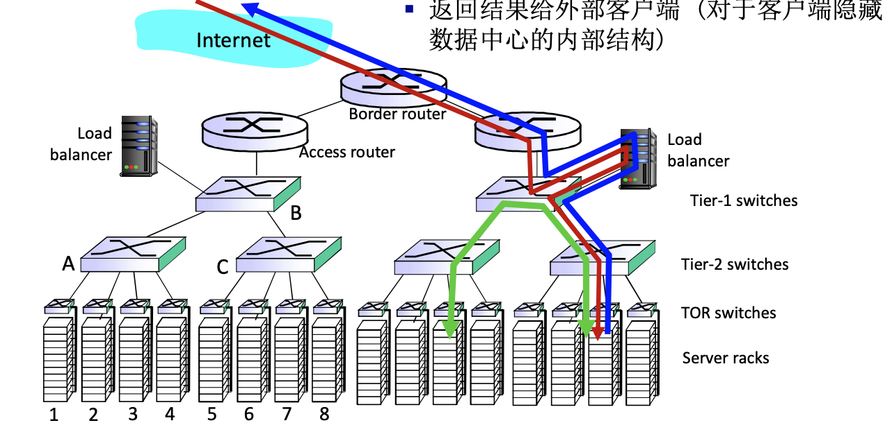
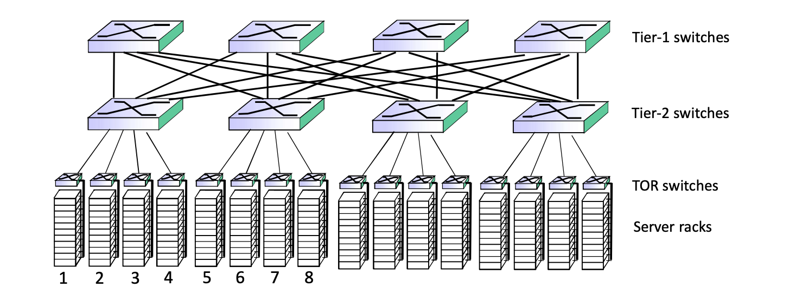

# 📘 6.6 数据中心网络 (Data Center Network)

> 来源说明：计算机网络教材第6.6节 | 本节涵盖：数据中心网络的规模特征、应用场景、核心挑战、层次化架构、负载均衡与冗余互连设计

---

## 🧠 核心概念总览（严格按原文顺序）

- [*知识点1: 数据中心网络的定义、规模与应用场景*](#id1)
- [*知识点2: 核心挑战与瓶颈避免策略*](#id2)
- [*知识点3: 层次化网络架构与各级设备分工*](#id3)
- [*知识点4: 负载均衡器：应用层路由与内部结构隐藏*](#id4)
- [*知识点5: 交换机之间的丰富互连：多路径与冗余*](#id5)

---

## ✅ 知识点1: 数据中心网络的定义、规模与应用场景

**背景**
- `数据中心网络(Data Center Network, DC Network)`：由**数万到数十万台主机**构成的大规模网络系统，核心特征为**密集耦合(Tightly Coupled)**、**距离临近(Proximity)**
- 三大主要应用场景：
  1. **电子商务(E-commerce)**：如 `Amazon`，要求高可用与低延迟
  2. **内容服务器(Content Servers)**：如 `YouTube`、`Akamai`、`Apple`、`Microsoft`，支撑 `CDN(Content Delivery Network)` 核心节点
  3. **搜索引擎与数据挖掘(Search Engines & Data Mining)**：如 `Google`，涉及海量数据索引与并行计算

- > 💡 **理解技巧**：数据中心像一个"超级计算机机房"——几万台电脑被高速网络"胶水"粘在一起，内部协作远大于外部通信

---

## ✅ 知识点2: 核心挑战与瓶颈避免策略

**两大挑战**
- 两大核心挑战：
  1. **多种应用服务海量客户端**：不同应用流量模式各异（突发、持续、交互式）
  2. **管理与负载均衡**：避免**处理瓶颈(Processing Bottleneck)**、**网络瓶颈(Network Bottleneck)**、**数据瓶颈(Data Bottleneck)**
- 瓶颈避免策略：
  - **处理层面**：负载均衡将请求均匀分发到多台服务器，避免单台CPU/内存过载
  - **网络层面**：多路径分发（ECMP）避免单链路拥塞，QoS保障关键流量带宽
  - **数据层面**：数据分片(Sharding)、缓存层(Cache Layer)、读写分离分散数据访问压力

---

## ✅ 知识点3: 层次化网络架构与各级设备分工

典型层次化架构（从外到内）：

- 各层分工：
  - **Border Router（边界路由器）**：连接外部Internet，对外发布IP前缀，执行安全防护
  - **Access Router（接入路由器）**：内部第一层路由，连接Border Router与负载均衡器/交换机
  - **Tier-1 Switches（第一层交换机）**：核心汇聚层，连接多个Tier-2，高带宽、高可靠性
  - **Tier-2 Switches（第二层交换机）**：汇聚/分发层，连接Tier-1与TOR，执行流量聚合和策略
  - **TOR Switches（机架顶交换机）**：接入层，位于机架顶部，直接连接服务器机架内所有服务器（24-48口下行），是服务器第一跳网络设备

- > ⚠️ **关键区分**：传统三层架构（Core-Aggregation-Access）与现代 `Spine-Leaf` 架构有本质区别——教材图示为传统层次架构，现代数据中心更常用Clos网络拓扑减少层级以降低东西向延迟

---

## ✅ 知识点4: 负载均衡器：应用层路由与内部结构隐藏

**负载均衡角色定位**
- `负载均衡器(Load Balancer)`：数据中心网络的**流量入口调度器**，工作在**应用层（Layer 7）**
- 三大核心功能：
  1. **接受外部请求**：接收来自 `Internet` 的客户端请求
  2. **请求分发**：将请求导入到数据中心内部的合适服务器（可基于HTTP头、URL、Cookie、健康状态等智能分发）
  3. **返回结果**：将服务器处理结果返回给外部客户端
- **内部结构隐藏(Internal Structure Hiding)**：
  - 客户端只与负载均衡器的公网IP/虚拟IP交互
  - 后端服务器的真实IP、数量、拓扑对客户端完全透明
  - 优势：安全性（减少攻击暴露面）、弹性（动态扩缩容无感知）、维护性（服务器替换不影响客户端）

- > ⚠️ **关键区分**：负载均衡器工作在**应用层**，与基于IP/端口的四层负载均衡不同——可以基于应用语义做智能分发，而不仅是网络元组
- > 📋 **术语提醒**：现代负载均衡方案包括硬件（F5、A10）和软件（Nginx、HAProxy、LVS），数据中心大量使用软件定义方案

---

## ✅ 知识点5: 交换机之间的丰富互连：多路径与冗余

**理论**
- 数据中心核心设计理念：在交换机之间、机器阵列之间提供**丰富的互连措施**，实现两大目标：
  1. **增加吞吐(Increase Throughput)**：通过多条并行路径提升整体带宽
  2. **增加可靠性(Increase Reliability)**：通过冗余连接避免单点故障

---

## 🔑 核心要点总结

1. **数据中心网络规模**：数万到数十万台主机，密集耦合、距离临近，支撑电商/内容/搜索三大应用
2. **核心挑战**：多种应用×海量客户端，需避免处理/网络/数据三大瓶颈，通过负载均衡、多路径、数据分片等策略应对
3. **层次化架构**：Internet → Border Router → Access Router → Load Balancer → Tier-1 → Tier-2 → TOR → Server Racks，各层分工明确
4. **负载均衡器**：应用层路由（Layer 7），接受外部请求、智能分发、返回结果，隐藏内部结构（VIP+后端私有IP）
5. **互连设计**：丰富互连（多路径+冗余）→ ECMP增加吞吐、Clos/Fat-Tree拓扑提升可靠性，注意流一致性避免TCP乱序
6. **设计哲学**：规模优先、廉价冗余、东西向优化、自动化运维、应用感知，COTS+开源软件+SDN

## 📌 考试速记版

- **关键机制**：
  - 负载均衡器功能：接受外部请求 → 导入内部 → 返回结果（隐藏内部结构）
  - 层次架构：Border → Access → LB → Tier-1 → Tier-2 → TOR → Server Racks
  - 互连措施：多路径（ECMP增加吞吐）+ 冗余（增加可靠性）

- **易混淆概念对比**：

| 对比维度 | 传统企业网络 | 数据中心网络 |
|---------|------------|------------|
| 流量方向 | 南北向（客户端→服务器） | 东西向（服务器间） |
| 扩展方式 | 垂直（升级设备） | 水平（增加设备） |
| 拓扑 | 三层架构 | Clos/Fat-Tree/Spine-Leaf |
| 延迟容忍 | 毫秒级 | 微秒级 |

- **常见考试陷阱**：
  - ❌ 数据中心只为外部服务？→ ✅ 内部东西向流量往往**大于**南北向流量
  - ❌ 负载均衡只在网络层？→ ✅ 教材强调是**应用层路由**（Layer 7）
  - ❌ 多路径随便用？→ ✅ 需注意**流一致性**（同一TCP流的包走同一路径）
  - ❌ TOR就是普通交换机？→ ✅ TOR是**服务器第一跳**，上行带宽是机架级瓶颈

**记忆口诀**：
> "数万主机聚一屋，电商搜索视频流；边界接入再均衡，一二层交换机连TOR；多路冗余增吞吐，东西向流是主角；廉价设备可扩展，云里雾里靠SDN。"
