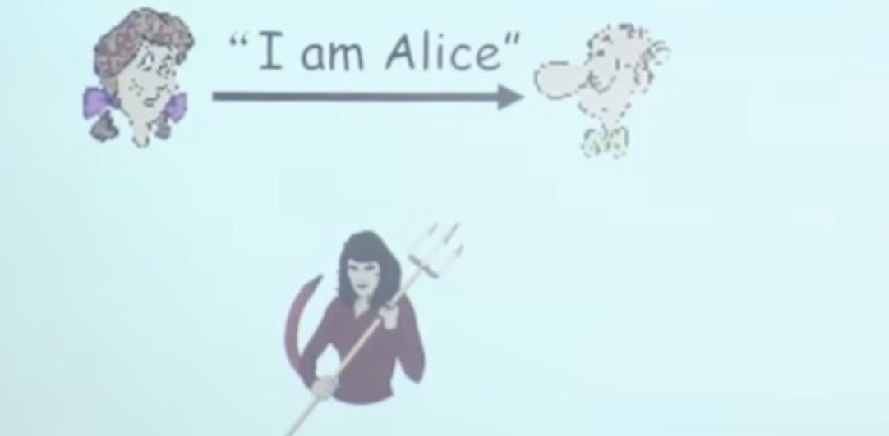
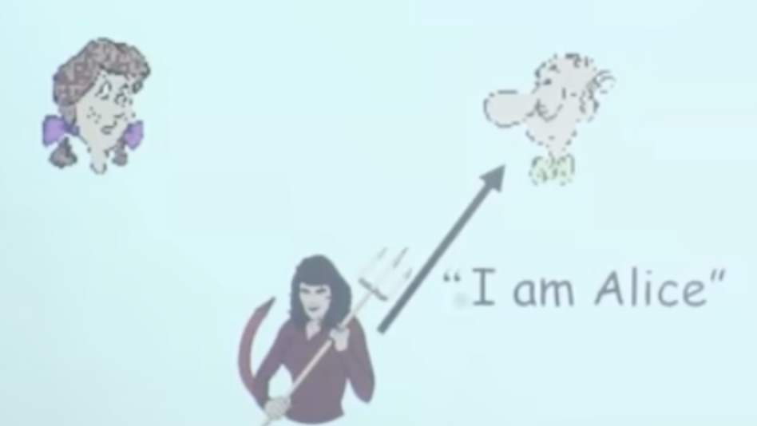
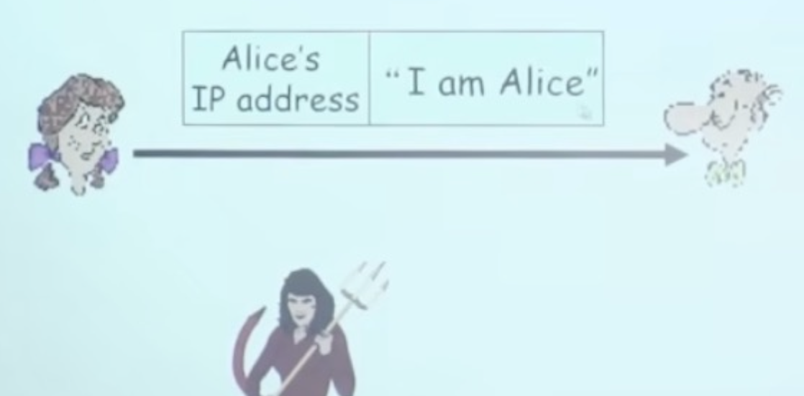
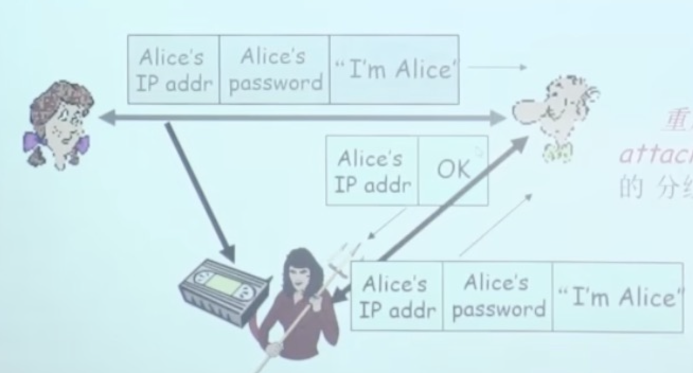
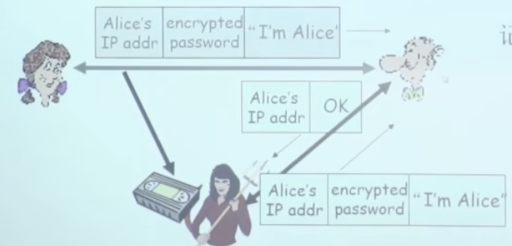
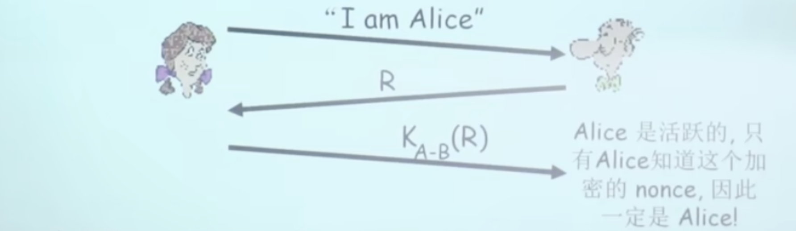
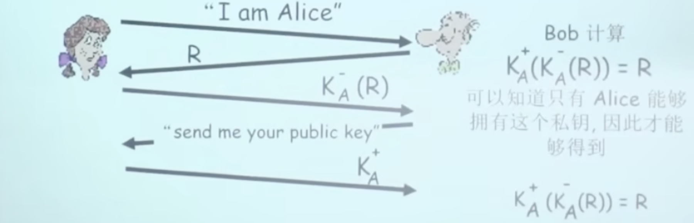
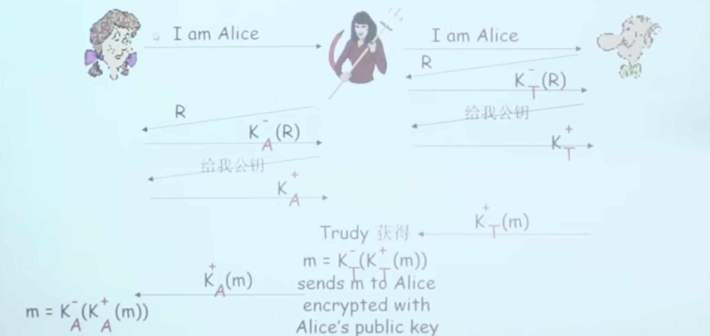

# 📘 章节 8.3 认证协议 (Authentication Protocols)

> 来源说明：计算机网络（郑老师）第8.3节 | 本节涵盖：认证协议的演进、各类攻击方式与防御机制

---

## 🧠 核心概念总览（严格按原文顺序）

- [*知识点1: 认证目标与基本威胁模型*](#id1)
- [*知识点2: ap1.0协议——简单声明*](#id2)
- [*知识点3: ap2.0协议——IP地址验证*](#id4)
- [*知识点4: ap3.0协议——密码验证*](#id6)
- [*知识点5: ap3.1协议——加密密码验证*](#id8)
- [*知识点6: ap4.0协议——Nonce与对称密钥认证*](#id10)
- [*知识点7: ap5.0协议——公钥认证*](#id11)
- [*知识点8: ap5.0漏洞——中间人攻击*](#id12)
- [*知识点9: 中间人攻击的隐蔽性*](#id13)

---

## ✅ 知识点1: 认证目标与基本威胁模型

**理论**
- 认证(`Authentication`)的核心目标：**Bob需要Alice证明她的身份**
- 基本场景：通信双方（Alice和Bob）在网络中通信，需要验证对方身份
- 攻击者：Trudy（传统攻击者名称）试图冒充合法用户
- **关键假设**：在网络上Bob看不到Alice的物理实体，只能通过网络报文交互

- > ⚠️ **关键区分**：认证关注的是**身份验证**，不是消息加密或完整性保护——即使消息内容正确，发送者也可能假冒

---

## ✅ 知识点2: ap1.0协议——简单声明

**简单声明**
- **Protocol ap1.0**：Alice直接向Bob发送声明："I am Alice"
  - 协议流程：
    - Alice → Bob: "I am Alice"
  - 这是最简单的认证尝试，仅依赖**声明者的自我宣称**
- 没有任何附加验证信息
- > **核心问题**：缺乏**验证凭证**——声明本身不可信

---

## ✅ 知识点3: ap2.0协议——IP地址验证

**IP地址验证**
- **Protocol ap2.0**：Alice说"I am Alice"，并在发送的IP数据包中**包含她的IP地址**
  - 协议流程：
    - Alice → Bob: [Alice's IP address] + "I am Alice"
  - 改进思路：用IP地址作为身份标识——**假设IP地址与身份绑定**
- 攻击者可以发送源IP地址为Alice地址的IP数据包
- > **核心问题**：IP地址可以被伪造(`IP Spoofing`)

- > ⚠️ **关键区分**：IP伪造是**网络层攻击**——IP地址本身不提供安全保护，仅靠IP地址无法验证真实身份

---

## ✅ 知识点4: ap3.0协议——密码验证

**密码验证**
- **Protocol ap3.0**：Alice说"I am Alice"，而且**传送她的密码来证明**
  - 协议流程：
    - Alice → Bob: [Alice's IP address] + [Alice's password] + "I am Alice"
  - 改进思路：用**密码**作为共享秘密——只有真正的Alice知道密码
  - Bob验证：检查密码是否匹配预先存储的Alice密码

- **失败场景**：**重放攻击(`Playback Attack` / `Replay Attack`)**
  
  - 攻击流程：
    1. Trudy**记录**Alice发送给Bob的分组（包含Alice的IP地址、密码、"I am Alice"）
    2. 事后，Trudy**向Bob重放**这个记录的分组
    3. Bob收到重放的分组，验证密码正确，认为Trudy是Alice
- > **核心问题**：密码本身被暴露了——即使攻击者不知道密码内容，也可以复制有效凭证

---

## ✅ 知识点5: ap3.1协议——加密密码验证

**加密密码验证**
- **Protocol ap3.1**：Alice说"I am Alice"，而且传送**加密之后的密码**来证明
- 协议流程：
  - Alice → Bob: [Alice's IP address] + [encrypted password] + "I am Alice"
  - 改进思路：加密密码以防止**窃听者获取明文密码**
  - 加密方式：使用双方约定好的密钥加密密码

- **失败场景**：即使密码被加密，**记录后重放仍然有效**

- > **核心问题**：加密只保护了**机密性**，没有保护**新鲜性**——Bob无法区分这是当前请求还是重放的分组

---

## ✅ 知识点6: ap4.0协议——Nonce与对称密钥认证

**对称密钥认证**
- **目标**：避免重放攻击，证明Alice的**活跃性**(`liveness`)
- **Nonce**：**一生只用一次的整数**(`R`)——`number used once`
- **Protocol ap4.0**流程：
  1. Alice → Bob: "I am Alice"
  2. Bob → Alice: `R`（nonce，随机数）
  3. Alice → Bob: $K_{A-B}(R)$（用双方约定的密钥加密nonce）

- 验证逻辑：
  - Bob解密后检查是否等于R
  - 如果正确，说明Alice是活跃的——**只有Alice知道这个加密的nonce**
  - 因为R每次不同，重放旧的分组无效
- > ⚠️ **关键假设**：ap4.0需要**双方共享一个对称式密钥**($K_{A-B}$)

---

## ✅ 知识点7: ap5.0协议——公钥认证

**公钥认证**
- **ap4.0的局限**：需要双方共享一个对称密钥——密钥分发本身就是问题
- **核心问题**：是否可以通过**公开密钥技术**进行认证？
- **Protocol ap5.0**：使用nonce + **公开密钥加密技术**
- 协议流程：
  1. Alice → Bob: "I am Alice"
  2. Bob → Alice: `R`（nonce）
  3. Alice → Bob: $K_A^-(R)$（用Alice的**私钥**加密nonce）
  4. Bob → Alice: "send me your public key"
  5. Alice → Bob: $K_A^+$（Alice的公钥）
  
- Bob验证：计算 $K_A^+(K_A^-(R)) = R$
  - 可以知道**只有Alice能够拥有这个私钥**，因此才能够得到正确结果
  - 因为 $K_A^+(K_A^-(R)) = R$ 成立

- > ⚠️ **关键区分**：与ap4.0的区别——**不需要共享对称密钥**，使用公钥/私钥对
- > 🔄 **知识关联**：这是数字签名(`digital signature`)的雏形——用私钥"签名"，用公钥验证
- > 📋 **术语提醒**：$K_A^-$ = Alice的私钥(`private key`)，$K_A^+$ = Alice的公钥(`public key`)

---

## ✅ 知识点8: ap5.0漏洞——中间人攻击

**核心漏洞**
- **中间人攻击(`Man-in-the-Middle Attack`)**：Trudy在Alice和Bob之间
- 攻击流程：
  - Trudy同时在Alice和Bob之间扮演双向角色
  - Alice → Trudy (伪装成Bob): "I am Alice"
  - Trudy → Bob (伪装成Alice): "I am Alice"
  - Bob → Trudy: `R`
  - Trudy → Alice: `R`
  - Alice → Trudy: $K_A^-(R)$（Alice的私钥加密）
  - Trudy → Bob: $K_T^-(R)$（Trudy用自己的私钥加密）
  - Bob → Trudy: "send me your public key"
  - Trudy → Bob: $K_T^+$（Trudy的公钥，伪装成Alice的）
  - Bob → Trudy (给Alice): "send me your public key"
  - Trudy → Alice: $K_A^+$（Alice的真实公钥）
- Trudy可以获得 $K_T^-(m)$，用公钥解密得到m，再用Alice的公钥加密发送给Alice

- > ⚠️ **关键警告**：中间人攻击的核心是**Trudy完全拦截并篡改通信**，双方都无法察觉

- > 🔄 **知识关联**：中间人攻击揭示了**公钥分发**的问题——如何确保你拿到的公钥真的是Alice的？

---

## ✅ 知识点9: 中间人攻击的隐蔽性

**理论**
- **中间人攻击难以检测**：
  - Bob收到了Alice发送的**所有报文**，反之亦然
  - 例如：Bob和Alice一个星期以后见面，回忆起以前的会话，内容完全匹配
  - **问题**：Trudy也接收到了**所有的报文**！
- 攻击特点：
  - 通信双方都认为自己在直接通信
  - 没有任何报文丢失或篡改的痕迹（从双方视角看）
  - 攻击者完全透明地存在于通信路径中

- > 🔄 **知识关联**：防御中间人攻击需要**公钥基础设施(PKI)** 或**可信第三方证书**来验证公钥真实性
- > 📋 **术语提醒**：这是公钥认证的核心挑战——**如何安全地分发公钥**

---

## 🔑 核心要点总结
1. 认证协议演进：ap1.0(简单声明) → ap2.0(IP地址) → ap3.0(密码) → ap3.1(加密密码) → ap4.0(Nonce+对称密钥) → ap5.0(Nonce+公钥)
2. 每次演进都解决上一个协议的漏洞，但引入新的假设和潜在问题
3. 重放攻击的核心防御：使用Nonce确保消息新鲜性
4. 公钥认证不需要共享对称密钥，但面临公钥分发的信任问题
5. 中间人攻击是公钥认证的最大威胁，需要PKI或证书机制解决

## 📌 考试速记版
- **ap1.0**：声明即可，无验证——可被任何人冒充
- **ap2.0**：IP地址验证——IP可被伪造(`IP Spoofing`)
- **ap3.0**：密码验证——面临重放攻击(`Playback Attack`)
- **ap3.1**：加密密码——加密不防重放，重放仍有效
- **ap4.0**：Nonce+对称密钥加密——证明活跃性，防重放，但需共享密钥
- **ap5.0**：Nonce+私钥加密+公钥验证——无需共享密钥，但面临中间人攻击
- **中间人攻击**：Trudy完全拦截双向通信，双方无法察觉，需PKI/证书防御
- **核心问题链**：身份声明 → IP绑定 → 密码共享 → 密码加密 → 新鲜性验证 → 公钥认证 → 公钥信任

**记忆口诀**："声明易被冒，IP可伪造，密码怕重放，加密也没用，Nonce证活跃，公钥免共享，中间人最难防，证书来帮忙"
