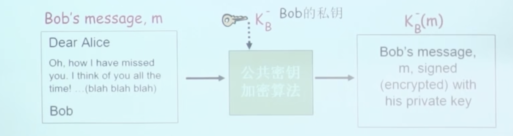
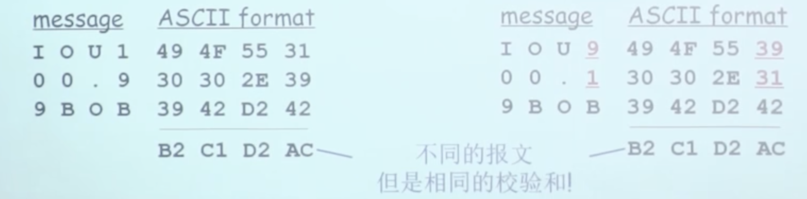
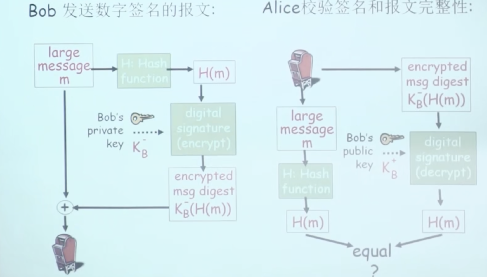

# 📘 章节 8.4 报文完整性 (Message Integrity)

> 来源说明：计算机网络（郑老师）第8.4节 | 本节涵盖：数字签名原理、报文摘要、散列函数、实际签名流程

---

## 🧠 核心概念总览（严格按原文顺序）

- [*知识点1: 数字签名概念与性质*](#id1)
- [*知识点2: 简单数字签名——私钥签署消息*](#id2)
- [*知识点3: 签名验证与不可抵赖性*](#id3)
- [*知识点4: 报文摘要与散列函数*](#id4)
- [*知识点5: Internet校验和——弱的散列函数*](#id5)
- [*知识点6: 实际数字签名流程——对摘要签名*](#id6)
- [*知识点7: 散列函数算法——MD5与SHA-1*](#id7)

---

## ✅ 知识点1: 数字签名概念与性质

**概览**
- 数字签名(`Digital Signature`)类比于**手写签名**
- **前提**：发送方(Bob)数字签署了文件，前提是他(她)是文件的**拥有者/创建者**
- 数字签名三大核心性质：
  1. **可验证性**(`Verifiable`)：接收方可以验证签名真实性
  2. **不可伪造性**(`Unforgeable`)：其他人无法伪造签名
  3. **不可抵赖性**(`Non-repudiable`)：签署者无法否认自己签署过

**签名验证维度**：
- **谁签署**：接收方(Alice)可以向他人证明是**Bob**，而不是其他人签署了这个文件（包括Alice）
- **签署了什么**：这份文件，而不是其它文件

> 💡 **理解技巧**：就像纸质合同上的手写签名+日期——签名证明是你，且你认可这份特定文件的内容

---

## ✅ 知识点2: 简单数字签名——私钥签署消息

**理论**
- **简单地对m的数字签名**：Bob使用**他自己的私钥**对m进行了签署，创建数字签名 $K_B^-(m)$
- 签名流程：
  - Bob的消息m → 公钥加密算法 → 用Bob的私钥 $K_B^-$ 加密 → 签名结果 $K_B^-(m)$
- **核心原理**：只有Bob拥有私钥 $K_B^-$，因此只有Bob能生成有效的 $K_B^-(m)$

---

## ✅ 知识点3: 签名验证与不可抵赖性

**理论**
- **假设Alice收到报文m，以及数字签名 $K_B^-(m)$**
- **验证过程**：Alice使用Bob的公钥 $K_B^+$ 对 $K_B^-(m)$ 进行验证，判断 $K_B^+(K_B^-(m)) = m$ 是否成立
- **验证逻辑**：
  - 如 $K_B^+(K_B^-(m)) = m$ 成立，那么签署这个文件的人**一定拥有Bob的私钥**
- **Alice可以验证三点**：
  1. ✓ Bob签署了m
  2. ✓ 不是其他人签署了m
  3. ✓ Bob签署了m而不是m'
- **不可抵赖性**：Alice可以拿着m，以及数字签名 $K_B^-(m)$ 到法庭上，来证明是Bob签署了这个文件m

> ⚠️ **关键区分**：不可抵赖性意味着**第三方可以独立验证**——不仅Alice相信，法院/任何

---

## ✅ 知识点4: 报文摘要与散列函数

**报文摘要**
- **问题**：对长报文进行公开密钥加密算法的实施需要**耗费大量的时间**
- **设计目的**：需要固定长度、容易计算的 **"fingerprint"**（指纹）
- **报文摘要**(`Message Digest`)：对m使用散列函数$H$，获得**固定长度**的报文摘要 $H(m)$
- **散列函数$H$的特性**：
  1. **多对1**：多个不同输入可能产生相同输出（碰撞存在）
  2. **结果固定长度**：无论输入多长，输出长度固定
  3. **单向性**：给定一个报文摘要x，反向计算出原报文在**计算上是不可行的**——$x = H(m)$，从x推m不可行

> ⚠️ **关键区分**：散列函数不是加密——**没有密钥**，且是**不可逆**的（加密可逆，散列不可逆）
> 💡 **理解技巧**：就像指纹——从人可以得到指纹，但从指纹无法还原整个人，且指纹长度固定

---

## ✅ 知识点5: Internet校验和——弱的散列函数

**理论**
- **Internet校验和**(`Internet Checksum`)拥有一些散列函数的特性：
  - 产生报文m的固定长度的摘要（**16-bit sum**）
  - 多对1的
- **但它是弱的散列函数**：给定一个散列值，**很容易计算出另外一个报文具有同样的散列值**
- **示例**：
  

> ⚠️ **关键警告**：Internet校验和**不能用于安全场景**——因为碰撞太容易构造，攻击者可以故意制造相同校验和的不同报文

---

## ✅ 知识点6: 实际数字签名流程——对摘要签名

**核心思想**：不对整条消息签名，而是对**报文摘要**签名——解决长报文签名效率问题
- **Bob发送数字签名的报文**（发送方流程）：
  1. 长消息m → 散列函数H → 得到摘要 $H(m)$
  2. 用Bob的私钥 $K_B^-$ 对摘要加密 → 得到 **加密的消息摘要** $K_B^-(H(m))$
  3. 发送：原始消息m + 加密的消息摘要 $K_B^-(H(m))$
- **Alice校验签名和报文完整性**（接收方流程）：
  1. 收到：原始消息m + 加密的消息摘要 $K_B^-(H(m))$
  2. 用Bob的公钥 $K_B^+$ 解密摘要 → 得到 $H(m)$（签名中的摘要）
  3. 对收到的消息m重新计算散列 → 得到 $H(m)$（本地计算的摘要）
  4. 比较两个摘要是否 **equal** → 如果相等，签名和完整性都验证通过

> ⚠️ **关键区分**：这个流程同时提供**可验证性**（私钥签名证明是Bob）+ **不可伪造性**（摘要匹配证明消息未被篡改）+ **不可抵赖性**（Alice可以拿着m，以及数字签名 $K_B^-(H(m))$证明 ）
> 🔄 **知识关联**：这是实际系统中（如SSL/TLS、代码签名）数字签名的标准实现方式

---

## ✅ 知识点7: 散列函数算法——MD5与SHA-1

**函数**
- **MD5散列函数**（RFC 1321）：被广泛应用
  - 4个步骤计算出**128-bit**的报文摘要
  - 给定一个任意的128-bit串x，**很难构造**出一个报文m具有相同的摘要x
- **SHA-1**也被使用：
  - US标准 [NIST, FIPS PUB 180-1]
  - **160-bit**报文摘要

**对比**：

| 算法 | 输出长度 | 标准 | 安全性 |
|-----|---------|------|--------|
| MD5 | 128-bit | RFC 1321 | 已被破解（碰撞攻击可行） |
| SHA-1 | 160-bit | NIST FIPS PUB 180-1 | 已被攻破（理论上不推荐） |

> ⚠️ **关键警告**：MD5和SHA-1都已被发现**碰撞漏洞**——现代系统应使用SHA-256或更强算法，但教材讲授的是基础概念
> 💡 **理解技巧**：算法长度越长，"试出碰撞"的空间越大——128-bit vs 160-bit vs 256-bit，安全性逐级提升

---

## 🔑 核心要点总结
1. 数字签名三大性质：可验证、不可伪造、不可抵赖——用私钥签，公钥验
2. 直接对长消息签名效率低，实际采用"对报文摘要签名"——签名摘要而非全文
3. 散列函数提供固定长度的消息指纹，关键特性：多对1、固定长度、单向性（不可逆）
4. Internet校验和是弱的散列函数——碰撞太容易构造，不能用于安全场景
5. MD5(128-bit)和SHA-1(160-bit)是经典算法，但现代应用应使用更安全的SHA-256+

## 📌 考试速记版
- **数字签名性质**：可验证、不可伪造、不可抵赖
- **签名 = 私钥加密**：$K_B^-(m)$，只有Bob能生成
- **验证 = 公钥解密**：$K_B^+(K_B^-(m)) = m$，任何人都可验证
- **实际签名流程**：m → H(m) → $K_B^-(H(m))$，发送 m + 签名摘要
- **验证流程**：解密签名得H(m)，本地计算H(m)，比对是否相等
- **散列函数三特性**：多对1、固定长度、计算不可逆（单向）
- **校验和弱点**：16-bit太短，不同报文可产生相同校验和
- **MD5**：128-bit，RFC 1321；**SHA-1**：160-bit，NIST标准

**记忆口诀**："私钥签公钥验，摘要签名效率高，散列指纹固定长，单向不可逆最强，校验和弱不防撞，MD5和SHA-1是经典"
