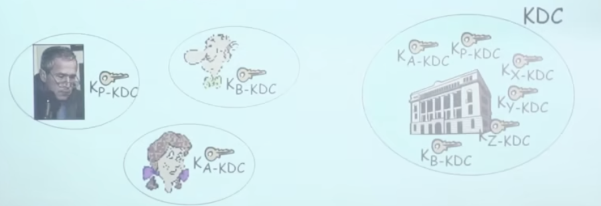
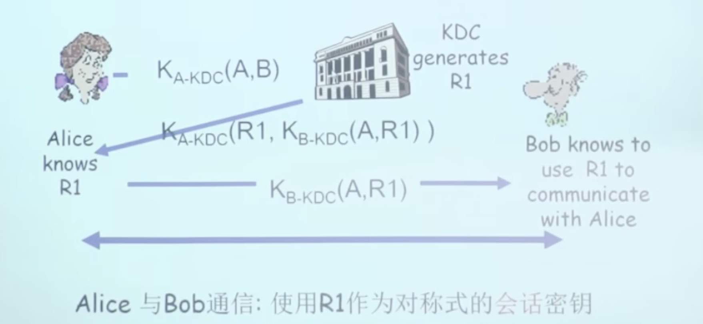
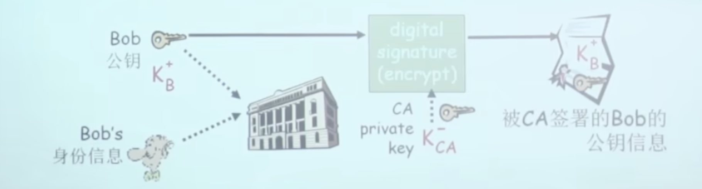
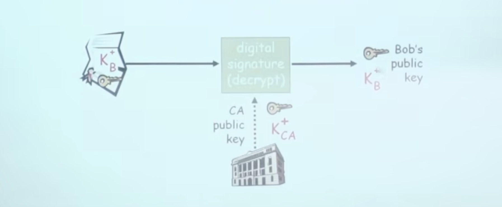
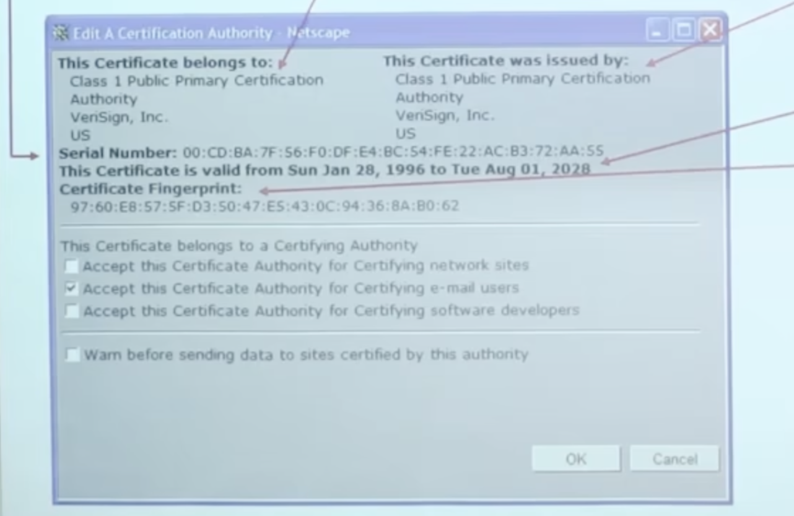

# 📘 章节 8.5 密钥分发和证书 (Key Distribution and Certificates)

> 来源说明：计算机网络（郑老师）第8.5节 | 本节涵盖：对称密钥分发、KDC机制、公钥认证、CA证书体系、信任链

---

## 🧠 核心概念总览（严格按原文顺序）

- [*知识点1: 密钥分发问题——对称密钥与公钥*](#id1)
- [*知识点2: 密钥分发中心(KDC)*](#id2)
- [*知识点3: KDC会话密钥分发流程*](#id3)
- [*知识点4: 认证机构(CA)与证书*](#id4)
- [*知识点5: CA公钥验证流程*](#id5)
- [*知识点6: 证书内容组成*](#id6)
- [*知识点7: 信任树与根证书*](#id7)

---

## ✅ 知识点1: 密钥分发问题——对称密钥与公钥

**对称密钥问题**：相互通信的实体如何分享对称式的密钥？
- **公钥问题**：当Alice获得Bob的公钥（from web site, e-mail, diskette），她如何知道就是Bob的public key，而不是Trudy的？
- **核心矛盾**：密钥分发是密码学应用的前提——没有安全的密钥分发，加密和签名都无法实施
- **解决办法**：需要**可信赖中介**(`Trusted Intermediary`)

**两种场景的解决方案**：
- 对称密钥 → **KDC**(`Key Distribution Center`)：在实体之间扮演可信赖中介的角色
- 公钥 → **CA**(`Certification Authority`)：可信赖的认证机构

Q：**如何获取与可信赖中介中间的沟通公共密钥？**
- A：优先**带外渠道**获取可信中介公钥：装机预装、U盘拷贝、电话/短信核对指纹、独立内网分发；

>⚠️ **关键区分**：KDC解决"如何安全地共享对称密钥"，CA解决"如何安全地获取公钥"——两者都是信任基础设施，但解决的问题不同
>💡 **理解技巧**：就像租房——KDC是中介保管钥匙，CA是房管局验证房产证真伪

---

## ✅ 知识点2: 密钥分发中心(KDC)

**KDC**(`Key Distribution Center`)：服务器和每一个注册用户都分享一个对称式的密钥
- **前提假设**：Alice, Bob需要**分享对称式密钥**，但他们没有直接共享的密钥
- **KDC的密钥结构**：
  - KDC与每个注册用户共享一个独立的对称密钥
  - Alice知道 $K_{A-KDC}$（Alice与KDC的共享密钥）
  - Bob知道 $K_{B-KDC}$（Bob与KDC的共享密钥）
  - KDC知道所有 $K_{X-KDC}$（KDC与所有用户的共享密钥）
- **核心功能**：KDC作为**可信第三方**，帮助Alice和Bob建立会话密钥

> ⚠️ **关键假设**：KDC必须是绝对可信的——如果KDC被攻破，所有用户的密钥都暴露
> 💡 **理解技巧**：KDC就像酒店的钥匙托管中心——每个住客把备用钥匙放前台，前台可以帮两个住客传递临时钥匙

---

## ✅ 知识点3: KDC会话密钥分发流程

**问题**：KDC如何使得Bob和Alice在和对方通信前，就对称式会话密钥达成一致？
- **流程**：
  1. Alice → KDC: $K_{A-KDC}(A, B)$（用Alice-KDC密钥加密，表明想和Bob通信）
  2. KDC生成随机数 $R_1$（会话密钥候选）
  3. KDC → Alice: $K_{A-KDC}(R_1, K_{B-KDC}(A, R_1))$
     - 用Alice-KDC密钥加密：包含会话密钥 $R_1$ 和给Bob的票据
  4. Alice知道 $R_1$（解密后获得）
  5. Alice → Bob: $K_{B-KDC}(A, R_1)$（把KDC给的票据转发给Bob）
  6. Bob知道用 $R_1$ 与Alice通信（用Bob-KDC密钥解密票据）
  - > 💡 **理解技巧**：就像KDC给Alice一个"信封"（用Bob的密钥加密），Alice看不懂但可以直接转交给Bob，Bob能打开看到密钥

  
- **结果**：Alice与Bob通信，使用 $R_1$ 作为对称式的会话密钥

>⚠️ **关键区分**：KDC不直接传输会话密钥给Bob——而是通过"票据"(`ticket`)让Alice转发，减少KDC与Bob的直接通信
> 📋 **术语提醒**：$R_1$ = 会话密钥(`session key`)，票据 = `ticket`

---

## ✅ 知识点4: 认证机构(CA)与证书

**CA**(`Certification Authority` / 认证机构)：将每一个注册实体E和他的公钥捆绑
- **注册流程**：
  1. E（person, router）到CA那里注册他的公钥
  2. E提供给CA，自己身份的证据 "proof of identity"
  3. CA创建一个证书，捆绑了实体信息和他的公钥
- **证书**(`Certificate`)：
  - 包括了E的**公钥**
    - 被CA签署的（被CA用自己的**私钥加密的**）
    - CA说 "this is E's public key"
    >⚠️ **关键区分**：CA的"签名"是用CA的**私钥**加密——任何人可以用CA的公钥验证，但只有CA能生成这个签名
- **签名流程**：
  - Bob的公钥 $K_B^+$ + Bob的身份信息 → CA用私钥 $K_{CA}^-$ 签名 → 被CA签署的Bob的公钥信息
  

>💡 **理解技巧**：就像身份证——公安局（CA）用公章盖在你的信息上，任何人看到公章就知道这是公安局认可的

---

## ✅ 知识点5: CA公钥验证流程

**场景**：当Alice需要拿到Bob的公钥
- **获取流程**：
  1. 获得Bob的证书 certificate（从Bob或者其他地方）
  2. 对Bob的证书，使用**CA的公钥**来验证
  
- **验证逻辑**：
  - 证书中包含了用CA私钥签名的Bob公钥信息
    > ⚠️ **关键假设**：Alice必须**已经拥有并信任CA的公钥**——这是信任链的起点
  - 用CA公钥 $K_{CA}^+$ 解密验证 → 如果通过，确认证书中的 $K_B^+$ 确实是Bob的公钥
- **核心原理**：
  - Alice信任CA的公钥（预装或已知）
  - CA信任Bob的身份（通过proof of identity验证）
  - 所以Alice可以信任证书中的Bob公钥

> 💡 **理解技巧**：就像你信任公安局的公章，所以看到盖了公章的身份证就相信身份证上的人名和照片
> 🔄 **知识关联**：这解决了ap5.0的中间人攻击问题——不再需要直接从Bob获取公钥，而是通过可信第三方验证

---

## ✅ 知识点6: 证书内容组成

**证书大致界面**
- 证书包括以下核心信息：
  1. **串号**(`Serial Number`)：证书发行者唯一标识
  2. **证书拥有者信息**(`Subject`)：包括算法和密钥值本身（不显示出来）
  3. **证书发行者信息**(`Issuer`)：颁发证书的CA信息
  4. **有效日期**(`Validity Period`)：证书生效和失效时间
  5. **颁发者签名**(`Issuer Signature`)：CA用私钥对证书内容的签名
- **示例**（Netscape证书界面）：
  

> ⚠️ **关键区分**：证书中**不包含私钥**——只包含公钥和身份信息，私钥永远由拥有者自己保管
> 💡 **理解技巧**：证书就像名片——上面有你的名字（身份信息）、联系方式（公钥），但不会有你家钥匙（私钥）

---

## ✅ 知识点7: 信任树与根证书

**信任书/根证书**
- **根证书**(`Root Certificate`)：
  - 根证书是**用自身私钥签名的自签名证书**，是整套证书信任体系最顶层的信任源头。
  - 这样的话，可以自己就拿到一些CA的公钥
  - 然后这些CA的公钥可以被用于签发给其他实体证书
    > **自签名的证书**：证书签发者用自己的私钥给自己的公钥签名，没有上级证书背书，就是自签名，这样可以放置篡改。
  - 渠道：安装OS自带的数字证书；从网上下载你信任的数字证书
- **信任树**(`Trust Tree`)：
  - 信任根证书CA颁发的证书，就可以拿到了根CA的公钥 → **信任了根**
  - 由根CA签署的给一些机构的数字证书，包含了这些机构的数字证书
  - 由于你信任了根，从而能够可靠地拿到根CA签发的证书，并使用自己身上的公钥验证
> ⚠️ 信任根公钥靠带外预先获取，其他主体公钥靠带内传输的证书验证获得。
> 💡 **理解技巧**：就像信任体系中的"创世神"——根CA没有上级，它本身的存在就是信任的起点
> 🔄 **知识关联**：浏览器/操作系统预装根证书 → 访问HTTPS网站时验证证书链 → 根证书是信任锚点

---

## 🔑 核心要点总结
1. 密钥分发的两大问题：对称密钥共享（KDC解决）和公钥信任（CA解决）
2. KDC通过预共享的密钥+票据机制，让通信双方获得临时会话密钥
3. CA通过证书将实体身份与公钥绑定，用CA私钥签名保证不可伪造
4. 证书验证：用CA公钥验证证书签名，确认公钥归属
5. 证书包含：串号、所有者信息、发行者信息、有效期、签名
6. 信任树：根证书→中间CA→最终实体证书，形成层级信任链
7. 根证书是自签名的，必须预装信任，是整个PKI体系的信任起点

## 📌 考试速记版
- **KDC**：密钥分发中心，每个用户与KDC预共享对称密钥，KDC生成会话密钥通过票据分发
- **KDC流程**：Alice申请→KDC生成R1+票据→Alice收R1→转票据给Bob→双方用R1会话
- **CA**：认证机构，将实体身份与公钥绑定，用CA私钥签发证书
- **证书验证**：获取Bob证书→用CA公钥验证签名→确认公钥归属
- **证书内容**：串号、所有者信息、发行者信息、有效期、颁发者签名
- **信任树**：根证书（自签名/预装）→签发中间CA→签发实体证书，逐级验证
- **根证书**：信任锚点，必须预安装，无上级签名

**记忆口诀**："对称密钥找KDC，公钥信任找CA；KDC票据传密钥，CA证书绑身份；根证书是信任根，逐级验证链不断"
